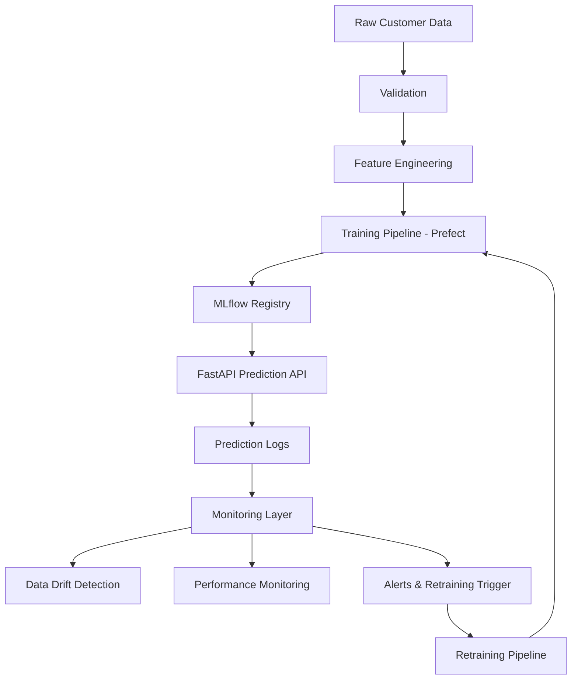
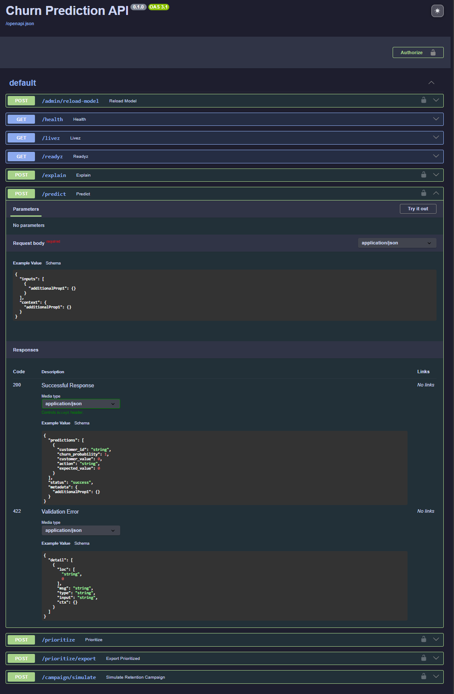
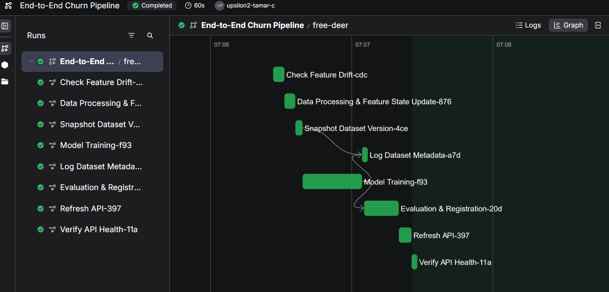
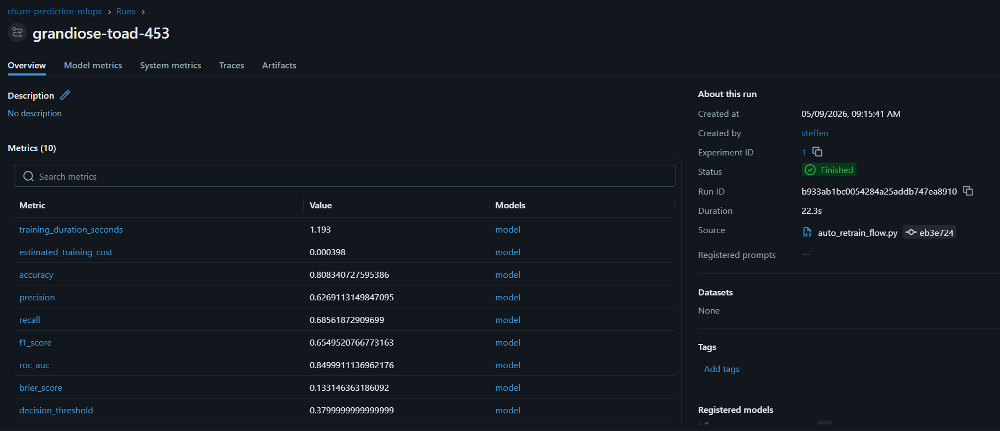
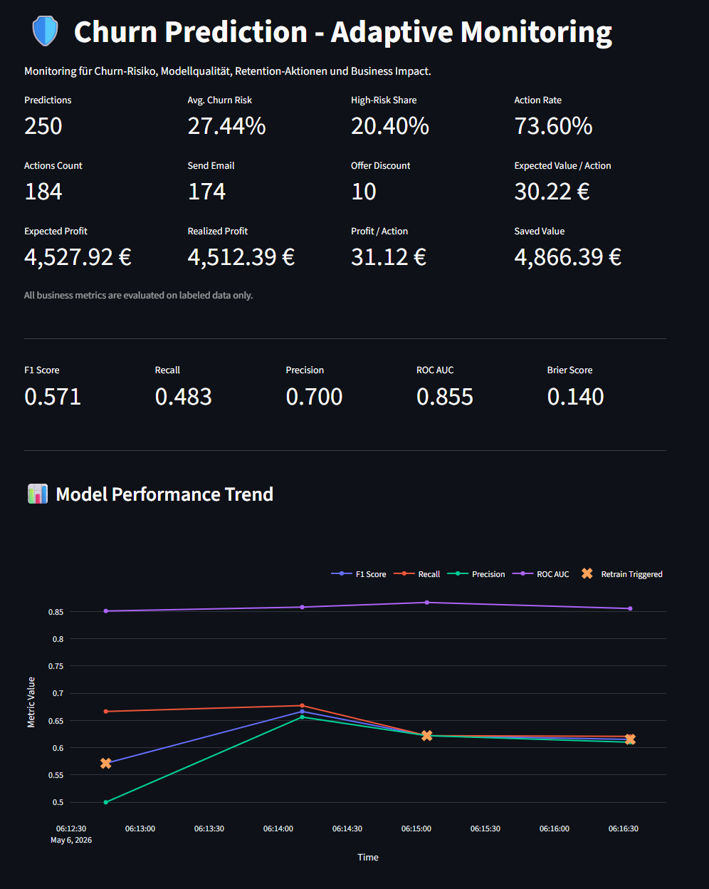
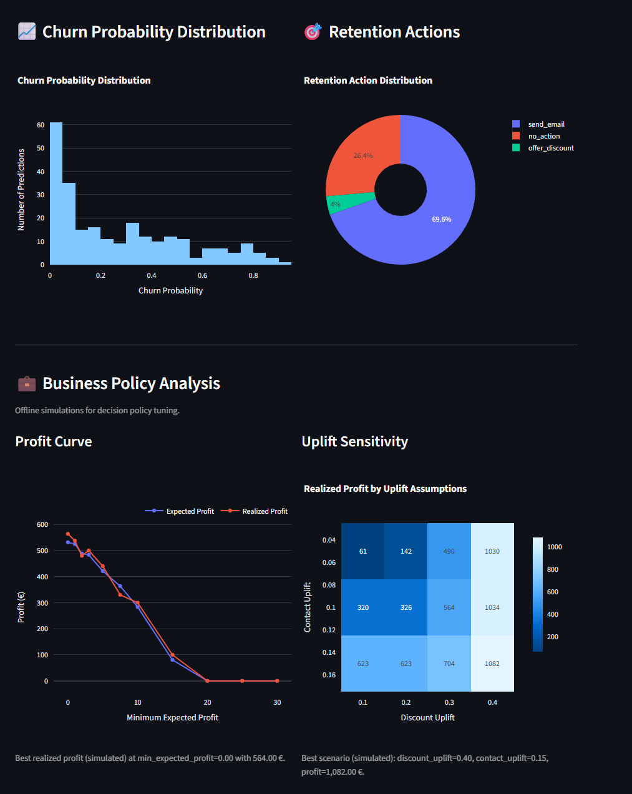
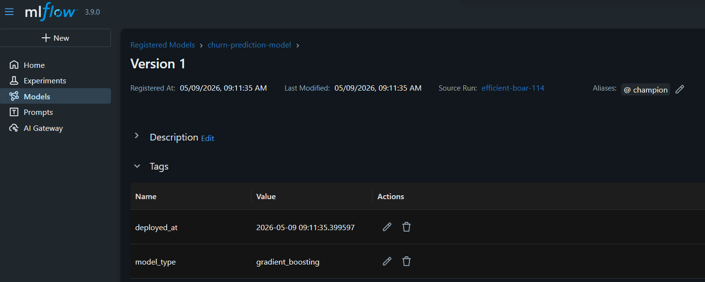
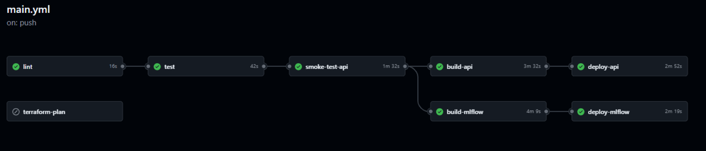
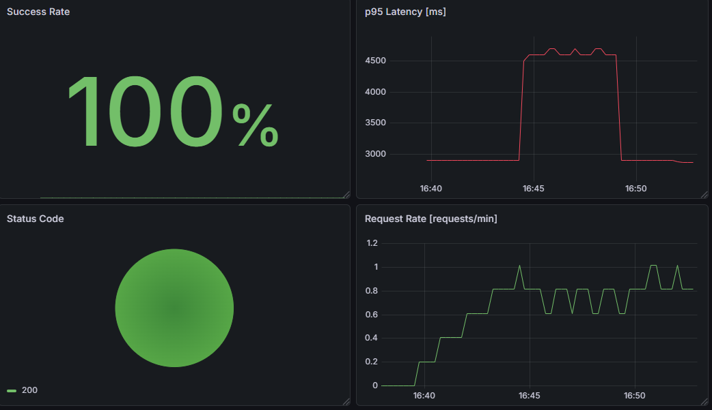

# 🚀 Production-Oriented MLOps Blueprint for Customer Churn Prediction

End-to-end MLOps showcase for deploying, monitoring and continuously improving machine learning models in a cloud-native production-style environment.

Customer churn prediction is used as the example use case, but the architecture is designed around reusable MLOps patterns: model serving, experiment tracking, model registry workflows, monitoring, automated retraining, CI/CD and infrastructure-as-code.

The focus is not only model training, but the engineering layer required to operate ML systems reliably after the model has been trained.


---

# 🎯 What This Project Demonstrates

This project demonstrates a production-oriented ML lifecycle beyond notebook-based modeling:

- FastAPI model serving for single and batch prediction
- MLflow experiment tracking and model registry workflows
- Champion/challenger promotion and controlled model rollout
- Prefect-based training and retraining orchestration
- Feature drift, delayed-label and performance monitoring
- Prometheus/Grafana metrics for API observability
- Business-oriented decision logic based on churn probabilities
- CI/CD with tests, Docker builds, Trivy scanning and Cloud Run deployment
- Infrastructure as Code with Terraform on Google Cloud Platform

The goal is to demonstrate reusable MLOps patterns for operating ML systems reliably over time.

---

# 🧩 Blueprint Positioning

This repository is the classification and decisioning variant of a reusable MLOps blueprint.

The goal is not to optimize one specific dataset, but to show how the same production-oriented ML architecture can be adapted to different machine learning problem types.

| Project | Problem Type | Use Case | Main Adapted Components |
|---|---|---|---|
| Customer Churn MLOps | Binary Classification | Retention risk prediction | Classification metrics, churn decision logic, delayed labels |
| Sales Forecasting MLOps | Time Series / Regression | Demand prediction | Temporal features, forecasting state, regression monitoring |

The shared lifecycle is: data validation, feature engineering, training, MLflow tracking and registry, API serving, prediction logging, monitoring, retraining and CI/CD deployment.

The churn use case mainly adapts the domain-specific layers: classification metrics, delayed-label evaluation, churn-risk monitoring and business-oriented retention decision logic.

---

# 🖥️ Demo Highlights

The repository includes screenshots and examples for:

- FastAPI Swagger UI for prediction and explainability endpoints
- MLflow experiment tracking and model registry
- Prefect training and retraining flows
- Streamlit dashboard for model and business monitoring
- Grafana dashboard for API metrics
- GitHub Actions CI/CD pipeline

---

# 🏗️ Architecture Overview

The platform implements a complete operational ML lifecycle including:

* data validation
* feature engineering
* experiment tracking
* model serving
* monitoring
* automated retraining
* CI/CD deployment



---

# 🔌 API & Model Serving

The platform exposes a production-style FastAPI inference service with:

* single and batch prediction support
* prediction explanations via `/explain`
* customer prioritization via `/prioritize`
* campaign simulation support
* health, liveness and readiness probes
* Prometheus metrics via `/metrics`
* authenticated inference requests
* OpenAPI documentation via Swagger UI
* structured prediction metadata including request IDs, timing and model information

The API is containerized and deployed to Google Cloud Run.

<p align="center">
  
</p>

---

# 🔁 Automated Training & Retraining

Training and retraining workflows are orchestrated with Prefect.

The pipeline automates:

* feature drift checks
* dataset snapshotting
* feature processing
* model training
* evaluation & registration
* API refresh & health verification

Retraining workflows can be triggered by monitoring signals or scheduled execution.

<p align="center">
  
</p>

---

# 📊 Experiment Tracking & Model Evaluation

MLflow is used for experiment tracking, metric logging and model lineage management.

Tracked metrics include:

* accuracy
* precision / recall
* ROC AUC
* calibration metrics
* decision thresholds
* business impact metrics
* estimated training costs

<p align="center">
  
</p>

---

# 📈 Operational Monitoring Dashboard

The platform includes a custom Streamlit monitoring dashboard for operational ML observability and business decision analytics.

The dashboard combines:

* model performance monitoring
* retraining trigger visualization
* retention action analytics
* expected-value evaluation
* business policy simulation
* churn risk distribution analysis

This layer demonstrates how ML systems can be monitored not only technically, but also from a business-impact perspective.

<p align="center">
  
</p>

<p align="center">
  
</p>

---

# 🏆 Model Registry & Promotion Workflow

Models are versioned and promoted through the MLflow Model Registry.

The platform supports:

* champion model aliases
* model versioning
* reproducible artifacts
* deployment metadata
* automated model promotion

The serving API loads the active champion model from the registry and exposes an administrative reload endpoint so newly promoted models can be picked up without rebuilding the API image.

The registry workflow is designed to support controlled model promotion and rollback patterns using MLflow aliases.

This enables reproducible and traceable production deployments.

<p align="center">
  
</p>

---

# 🚀 CI/CD & Cloud Deployment

The project includes a fully automated CI/CD pipeline using GitHub Actions.

Pipeline stages include:

- linting
- unit & integration tests
- API smoke tests
- Docker image builds
- vulnerability scanning with Trivy
- container registry publishing
- Cloud Run deployment

The deployment workflow validates, builds, scans and deploys the services automatically on every push to `main`.

<p align="center">
  
</p>

---

# ⚙️ Key Capabilities

## 📊 Monitoring & Observability

The platform includes operational ML monitoring capabilities for both technical and business-level evaluation.

Monitoring features include:

- feature drift detection
- production inference logging
- delayed ground-truth evaluation
- classification performance monitoring
- business impact metrics
- retraining trigger evaluation
- retention action distribution
- expected-value based decision monitoring
- prediction and request metadata logging
- Prometheus metrics
- Grafana dashboards

The monitoring layer continuously evaluates whether the currently deployed champion model still satisfies production quality requirements from both a technical and business-impact perspective.

---

## 📈 Operational API Monitoring

Prometheus and Grafana are used for operational API observability and runtime monitoring.

Tracked metrics include:

- prediction request throughput
- p95 inference latency
- response status distribution
- API success and error rates

<p align="center">
  
</p>

---

## 🕒 Delayed Label Handling

The monitoring pipeline supports delayed ground-truth availability.

Predictions are logged immediately, while true churn labels may only become available days or weeks later.

The platform simulates this production scenario by:

- storing pending labels
- releasing delayed ground truth batches
- updating cumulative evaluation history
- recalculating production performance metrics

This mirrors real-world ML systems where outcome labels are not instantly available.

---

## 🔁 Automated Pipelines

* training pipelines with Prefect
* automated retraining workflows
* model evaluation & promotion
* MLflow experiment tracking
* automated model registration

---

## ♻️ Reproducibility

The platform emphasizes reproducible ML operations through:

- dataset versioning
- feature snapshots
- configuration-driven environments
- MLflow artifact tracking
- versioned model promotion
- infrastructure-as-code

Training datasets, processed features and model artifacts are versioned to support traceable and reproducible production workflows.

---

## 🔒 Security & Reliability

* Trivy container vulnerability scanning
* smoke tests before deployment
* automated linting & testing
* non-root Docker containers
* Workload Identity Federation authentication
* reproducible deployments
* configuration-driven environments

---

# 🔄 Continuous ML Lifecycle

This platform demonstrates a complete production ML lifecycle:

1. model is trained and registered
2. prediction API serves live requests
3. predictions and metadata are logged
4. monitoring detects degradation or drift
5. retraining pipeline is triggered
6. improved model is promoted and deployed

This lifecycle is demonstrated through local demo scripts that simulate inference batches, delayed label availability, performance monitoring and retraining decisions.

The goal is not static ML models — but continuously monitored and maintainable ML systems.

---

# 🔁 When Retraining Happens

Retraining is triggered when monitoring detects that the current champion model no longer meets defined production quality thresholds.

The system evaluates retraining based on:

- minimum number of labeled samples
- F1 score
- recall
- ROC AUC
- Brier score
- explicit monitoring trigger flags

Example retraining thresholds:

```yaml
min_f1: 0.60
min_recall: 0.65
min_roc_auc: 0.75
max_brier_score: 0.22
```

If the latest labeled performance window falls below these thresholds, the retraining flow is triggered and a new candidate model is trained and evaluated.

A newly trained model is only promoted to the production champion model if it outperforms the currently deployed champion according to the configured evaluation policy. 
The platform uses a champion/challenger workflow via the MLflow Model Registry.

This prevents automatic promotion of degraded models and ensures stable production behavior.

---

# 💰 Business Decision Logic

The API returns more than churn probabilities.

Predictions are converted into business actions using configurable expected-value logic.

For each customer, the system compares possible retention actions:

- send retention email
- offer discount
- no action

Each action is evaluated using:

- predicted churn probability
- estimated customer value
- intervention cost
- expected uplift
- minimum expected profit threshold

Example business configuration:

```yaml
customer_value: 100
cost_discount: 10
cost_contact: 2
discount_uplift: 0.3
contact_uplift: 0.1
min_expected_profit: 0.0
```
The API also supports customer prioritization and campaign simulation workflows, allowing churn scores to be translated into ranked retention actions and business-oriented decision scenarios.

---

# 🔁 Reusable Use Cases

Customer churn prediction is used as the example use case in this repository.

The same MLOps architecture can be adapted to other supervised ML problems where predictions need to be served, monitored and improved over time, such as:

- lead scoring
- trial-to-paid conversion prediction
- customer lifetime value prediction
- upsell and cross-sell propensity scoring
- fraud detection or risk scoring
- support ticket escalation prediction
- subscription cancellation prediction
- next-best-action systems

The churn use case is therefore mainly a vehicle for demonstrating reusable MLOps patterns: model serving, experiment tracking, registry-based promotion, monitoring, retraining, business decision logic and CI/CD.

---

# ☁️ Infrastructure Stack

## Core Stack

* Python 3.12
* FastAPI
* MLflow
* Prefect
* scikit-learn
* Pandas
* Docker

---

## Cloud & DevOps

* GCP Cloud Run
* GCP Artifact Registry
* Google Cloud Storage
* Terraform
* GitHub Actions
* Prometheus
* Grafana

---

# 📁 Project Structure

```text
.
├── configs/               # environment & infrastructure configs
│   ├── dev.yaml
│   ├── prod.yaml
│   └── gcp.yaml
│
├── src/                   # application source code
│   ├── api/
│   ├── data/
│   ├── deployment/
│   ├── monitoring/
│   ├── training/
│   └── inference/
│
├── flows/                 # Prefect orchestration flows
├── infrastructure/        # Terraform infrastructure
├── tests/                 # unit & integration tests
├── docs/                  # diagrams & documentation
├── scripts/               # helper scripts & demos
└── .github/workflows/    # CI/CD pipelines
```

---

# ⚡ Quick Start

The local demo starts the full MLOps stack with Docker Compose:

- FastAPI prediction API
- MLflow tracking server
- Prefect orchestration server
- PostgreSQL backend
- Prometheus metrics
- Grafana dashboard

After starting the services, run the training pipeline once to register an initial champion model.

## 1️⃣ Clone repository


```bash
git clone <your-repo-url>
cd churn-prediction-mlops
```

---

## 2️⃣ Configure environment

```bash
cp .env.example .env
```

Set required variables:

* API_KEY
* GCP configuration (optional for local development)

---

## 3️⃣ Start local services

```bash
make dev-up
```

This starts:

* FastAPI
* MLflow
* Prefect
* PostgreSQL
* Prometheus
* Grafana

---

## 4️⃣ Run training pipeline

```bash
make train-force
```

This executes:

* ingestion
* validation
* feature engineering
* model training
* MLflow registration

---

## 5️⃣ Optional: Run API outside Docker

If you want to run the FastAPI service locally without Docker:

```bash
uv run uvicorn src.api.app:app --host 0.0.0.0 --port 8080
```

---

## 6️⃣ Run tests

```bash
pytest tests -v
```
---

# 🧪 End-to-End Lifecycle Demo

The repository includes demo scripts for simulating an operational ML lifecycle:

- daily prediction batches
- delayed ground-truth label release
- performance evaluation
- retraining trigger checks
- optional automated retraining

After starting the local Docker Compose stack and running the initial training pipeline, execute:

```bash
make demo-churn-lifecycle
```

This runs the lifecycle simulation inside the API container and simulates prediction batches, delayed label release, performance evaluation and retraining decisions.

---

# 🔧 Configuration

The platform follows a configuration-driven architecture.

## Environment configs

* `configs/dev.yaml`
* `configs/staging.yaml`
* `configs/prod.yaml`
* `configs/gcp.yaml`
* `configs/monitoring.yaml`
* `configs/training.yaml`

---

## Environment switching

```bash
APP_ENV=dev
APP_ENV=prod
```

---

## Infrastructure configuration

Infrastructure values are injected via:

* GitHub Variables
* GitHub Secrets
* environment variables

This enables fully reproducible deployments across environments.

---

# ☁️ Deployment

Infrastructure is provisioned with Terraform.

Services are deployed automatically via GitHub Actions to:

* Cloud Run
* Artifact Registry
* Google Cloud Storage

---

## Terraform

```bash
cd infrastructure
terraform init
terraform apply
```

---

## GitHub Actions

CI/CD automatically handles:

* testing
* scanning
* image builds
* deployment

on every push to `main`.

---

# 📈 API Endpoints

If a live demo deployment is active, the API exposes:

## Swagger Documentation

```text
https://YOUR_API_URL/docs
```

---

## Health & Readiness Endpoint

```text
GET https://YOUR_API_URL/livez
GET https://YOUR_API_URL/readyz
```
---

## Metrics Endpoint

```text
GET https://YOUR_API_URL/metrics
```

---

## Prediction Endpoint

```text
POST https://YOUR_API_URL/predict
```

---

## Explanation Endpoint
```text
POST https://YOUR_API_URL/explain
```

---

## Customer Prioritization Endpoint
```text
POST https://YOUR_API_URL/prioritize
```

---

# 📦 Dataset

This project uses the Telco Customer Churn dataset as a realistic binary classification use case.

The dataset is not the main focus of the repository. It serves as a concrete example for demonstrating reusable MLOps architecture patterns:

- data validation
- feature processing
- model training
- model registry workflows
- API inference
- prediction logging
- delayed-label evaluation
- monitoring and retraining

The main focus is operational ML infrastructure, reproducibility and lifecycle automation.

---

# 🎯 Project Goals

This repository focuses on the operational layer of machine learning systems:

* production-oriented ML engineering
* model serving and API deployment
* experiment tracking and model registry workflows
* monitoring and observability
* delayed-label performance evaluation
* reproducible training and inference pipelines
* CI/CD for ML services
* automated retraining and model promotion
* business decision logic on top of predictions

The emphasis is on reliable ML infrastructure — not just model training or notebook experimentation.

---

# ⚠️ Limitations

This repository is a production-oriented portfolio showcase, not a fully managed enterprise platform.

For a real enterprise deployment, I would additionally consider:

- centralized cloud logging and alerting
- stricter IAM scoping per environment
- managed secret rotation
- load testing and explicit SLO definitions
- automated rollback workflows
- shadow model evaluation or canary deployment
- cost monitoring and budget alerts
- data privacy controls for customer-specific datasets
- blue/green deployment strategies

The goal of this project is to demonstrate realistic MLOps architecture patterns in a compact and reproducible showcase.

---

# 📄 License

MIT License

---

# 👨‍💻 Author

**Steffen Lauterbach**  
MLOps Engineer

Focused on production-oriented ML systems, model deployment, monitoring, retraining workflows and cloud-native ML infrastructure.

LinkedIn:  
https://www.linkedin.com/in/92-steffen-lauterbach