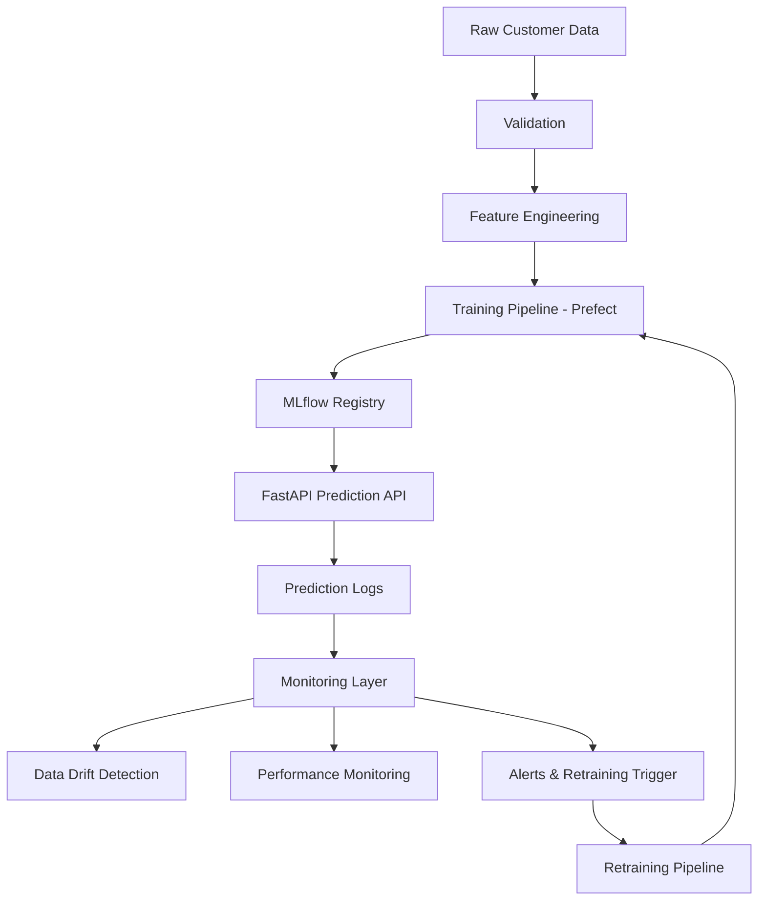

# 🚀 Production-Grade MLOps Blueprint for Customer Churn Prediction

Production-ready end-to-end MLOps platform for training, deploying, monitoring and continuously retraining customer churn models in production.

This repository serves as a reusable blueprint for production ML systems using:

* FastAPI
* MLflow
* Prefect
* Docker
* Terraform
* GitHub Actions
* Prometheus & Grafana
* Google Cloud Platform

The focus of this project is not only model training — but building reliable, observable and continuously maintainable ML systems.

---


# ⭐ Production Features

- automated retraining workflows
- champion/challenger model promotion
- delayed-label evaluation
- drift-aware monitoring
- infrastructure-as-code deployment
- CI/CD with security scanning
- reproducible ML pipelines

---

# 🏗️ Architecture Overview

The platform implements a complete operational ML lifecycle including:

* data validation
* feature engineering
* experiment tracking
* model serving
* monitoring
* automated retraining
* CI/CD deployment



---

# 🔌 API & Model Serving

The platform exposes a production-style FastAPI inference service with:

* batch prediction support
* explainability endpoints
* health & readiness probes
* Prometheus metrics
* authenticated inference requests
* OpenAPI documentation

The API is containerized and deployed to Google Cloud Run.

<p align="center">
  
</p>

---

# 🔁 Automated Training & Retraining

Training and retraining workflows are orchestrated with Prefect.

The pipeline automates:

* feature drift checks
* dataset snapshotting
* feature processing
* model training
* evaluation & registration
* API refresh & health verification

Retraining workflows can be triggered by monitoring signals or scheduled execution.

<p align="center">
  
</p>

---

# 📊 Experiment Tracking & Model Evaluation

MLflow is used for experiment tracking, metric logging and model lineage management.

Tracked metrics include:

* accuracy
* precision / recall
* ROC AUC
* calibration metrics
* decision thresholds
* business impact metrics
* estimated training costs

<p align="center">
  
</p>

---

# 🏆 Model Registry & Promotion Workflow

Models are versioned and promoted through the MLflow Model Registry.

The platform supports:

* champion model aliases
* model versioning
* reproducible artifacts
* deployment metadata
* automated model promotion

This enables reproducible and traceable production deployments.

<p align="center">
  
</p>

---

# 🚀 CI/CD & Production Deployment

The project includes a fully automated CI/CD pipeline using GitHub Actions.

Pipeline stages include:

- linting
- unit & integration tests
- API smoke tests
- Docker image builds
- vulnerability scanning with Trivy
- container registry publishing
- Cloud Run deployment

The deployment workflow validates, builds, scans and deploys production services automatically on every push to `main`.

<p align="center">
  
</p>

---

# ⚙️ Key Capabilities

## 🔌 Model Serving

* FastAPI inference API
* structured request/response logging
* health & liveness endpoints
* Prometheus metrics endpoint
* explainability endpoints
* champion model loading

---

## 📊 Monitoring & Observability

The platform includes operational ML monitoring capabilities for both technical and business-level evaluation.

Monitoring features include:

- feature drift detection
- production inference logging
- delayed ground-truth evaluation
- classification performance monitoring
- business impact metrics
- retraining trigger evaluation
- Prometheus metrics
- Grafana dashboards

The monitoring layer continuously evaluates whether the currently deployed champion model still satisfies production quality requirements.

---

## 🕒 Delayed Label Handling

The monitoring pipeline supports delayed ground-truth availability.

Predictions are logged immediately, while true churn labels may only become available days or weeks later.

The platform simulates this production scenario by:

- storing pending labels
- releasing delayed ground truth batches
- updating cumulative evaluation history
- recalculating production performance metrics

This mirrors real-world ML systems where outcome labels are not instantly available.

---

## 🔁 Automated Pipelines

* training pipelines with Prefect
* automated retraining workflows
* model evaluation & promotion
* MLflow experiment tracking
* automated model registration

---

## ☁️ Cloud Infrastructure

* Dockerized services
* Cloud Run deployment
* Artifact Registry integration
* Infrastructure-as-Code with Terraform
* GitHub Actions CI/CD pipeline
* GCS artifact persistence

---

## Infrastructure-as-Code

Cloud infrastructure is provisioned using Terraform, including:

- Cloud Run services
- Artifact Registry
- GCS buckets
- IAM configuration
- deployment variables

---

## ♻️ Reproducibility

The platform emphasizes reproducible ML operations through:

- dataset versioning
- feature snapshots
- configuration-driven environments
- MLflow artifact tracking
- versioned model promotion
- infrastructure-as-code

Training datasets, processed features and model artifacts are versioned to support traceable and reproducible production workflows.

---

## 🔒 Security & Reliability

* Trivy container vulnerability scanning
* smoke tests before deployment
* automated linting & testing
* non-root Docker containers
* Workload Identity Federation authentication
* reproducible deployments
* configuration-driven environments

---

# 🔄 Continuous ML Lifecycle

This platform demonstrates a complete production ML lifecycle:

1. model is trained and registered
2. prediction API serves live requests
3. predictions and metadata are logged
4. monitoring detects degradation or drift
5. retraining pipeline is triggered
6. improved model is promoted and deployed

The goal is not static ML models — but continuously monitored and maintainable ML systems.

---

# 🔁 When Retraining Happens

Retraining is triggered when monitoring detects that the current champion model no longer meets defined production quality thresholds.

The system evaluates retraining based on:

- minimum number of labeled samples
- F1 score
- recall
- ROC AUC
- Brier score
- explicit monitoring trigger flags

Example retraining thresholds:

```yaml
min_f1: 0.60
min_recall: 0.65
min_roc_auc: 0.75
max_brier_score: 0.22
```

If the latest labeled performance window falls below these thresholds, the retraining flow is triggered and a new candidate model is trained and evaluated.

A newly trained model is only promoted to the production champion model if it outperforms the currently deployed champion according to the configured evaluation policy. 
The platform uses a champion/challenger workflow via the MLflow Model Registry.

This prevents automatic promotion of degraded models and ensures stable production behavior.

---

# 💰 Business Decision Logic

The API does not only return churn probabilities.

Predictions are converted into business actions using configurable expected-value logic.

For each customer, the system compares possible retention actions:

- send retention email
- offer discount
- no action

Each action is evaluated using:

- predicted churn probability
- estimated customer value
- intervention cost
- expected uplift
- minimum expected profit threshold

Example business configuration:

```yaml
customer_value: 100
cost_discount: 10
cost_contact: 2
discount_uplift: 0.3
contact_uplift: 0.1
min_expected_profit: 0.0
```

This allows the platform to optimize not only for model accuracy, but also for expected business impact.

---

# ☁️ Infrastructure Stack

## Core Stack

* Python 3.12
* FastAPI
* MLflow
* Prefect
* scikit-learn
* Pandas
* Docker

---

## Cloud & DevOps

* GCP Cloud Run
* GCP Artifact Registry
* Google Cloud Storage
* Terraform
* GitHub Actions
* Prometheus
* Grafana

---

# 📁 Project Structure

```text
.
├── configs/               # environment & infrastructure configs
│   ├── dev.yaml
│   ├── prod.yaml
│   └── gcp.yaml
│
├── src/                   # application source code
│   ├── api/
│   ├── data/
│   ├── deployment/
│   ├── monitoring/
│   ├── training/
│   └── inference/
│
├── flows/                 # Prefect orchestration flows
├── infrastructure/        # Terraform infrastructure
├── tests/                 # unit & integration tests
├── docs/                  # diagrams & documentation
├── scripts/               # helper scripts & demos
└── .github/workflows/    # CI/CD pipelines
```

---

# ⚡ Quick Start

## 1️⃣ Clone repository

```bash
git clone <your-repo-url>
cd churn-prediction-mlops
```

---

## 2️⃣ Configure environment

```bash
cp .env.example .env
```

Set required variables:

* API_KEY
* GCP configuration (optional for local development)

---

## 3️⃣ Start local services

```bash
make dev-up
```

This starts:

* FastAPI
* MLflow
* Prefect
* PostgreSQL
* Prometheus
* Grafana

---

## 4️⃣ Run training pipeline

```bash
make train-force
```

This executes:

* ingestion
* validation
* feature engineering
* model training
* MLflow registration

---

## 5️⃣ Start inference API

```bash
uv run uvicorn src.api.app:app --host 0.0.0.0 --port 8080
```

---

## 6️⃣ Run tests

```bash
pytest tests -v
```

---

# 🔧 Configuration

The platform follows a configuration-driven architecture.

## Environment configs

* `configs/dev.yaml`
* `configs/staging.yaml`
* `configs/prod.yaml`
* `configs/gcp.yaml`
* `configs/monitoring.yaml`
* `configs/training.yaml`

---

## Environment switching

```bash
APP_ENV=dev
APP_ENV=prod
```

---

## Infrastructure configuration

Infrastructure values are injected via:

* GitHub Variables
* GitHub Secrets
* environment variables

This enables fully reproducible deployments across environments.

---

# ☁️ Deployment

Infrastructure is provisioned with Terraform.

Services are deployed automatically via GitHub Actions to:

* Cloud Run
* Artifact Registry
* Google Cloud Storage

---

## Terraform

```bash
cd infrastructure
terraform init
terraform apply
```

---

## GitHub Actions

CI/CD automatically handles:

* testing
* scanning
* image builds
* deployment

on every push to `main`.

---

# 📈 API Endpoints

## Swagger Documentation

```text
https://churn-prediction-api-5l2tmfys6q-ew.a.run.app/docs
```

---

## Health Endpoint

```text
https://churn-prediction-api-5l2tmfys6q-ew.a.run.app/livez
```

---

## Metrics Endpoint

```text
https://churn-prediction-api-5l2tmfys6q-ew.a.run.app/metrics
```

---

## Prediction Endpoint

```text
POST https://churn-prediction-api-5l2tmfys6q-ew.a.run.app/predict
```

---

# 📦 Dataset

This project uses the Telco Customer Churn dataset.

The platform is intentionally designed around reusable MLOps architecture patterns rather than dataset-specific modeling logic.

The focus is operational ML infrastructure, reproducibility and lifecycle automation.

---

# 🎯 Project Goals

This repository focuses on:

* production ML engineering
* operational ML systems
* cloud-native deployment
* monitoring & observability
* reproducibility
* CI/CD for ML systems
* automated retraining workflows

The emphasis is on reliable ML infrastructure — not just model training.

---

# 📄 License

MIT License

---

# 👨‍💻 Author

Steffen Lauterbach

MLOps Engineer

LinkedIn:
https://www.linkedin.com/in/92-steffen-lauterbach
