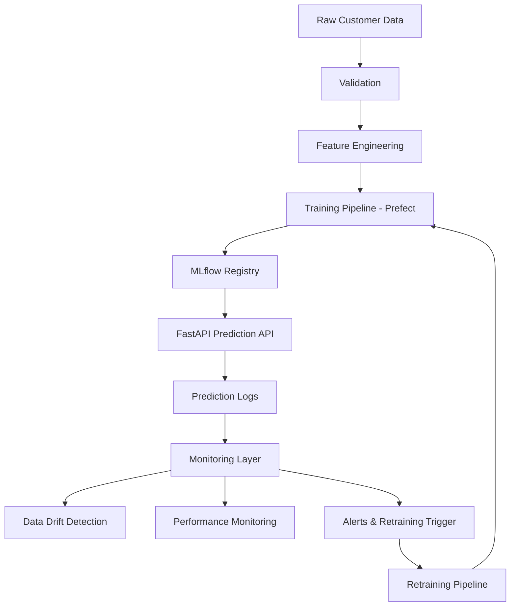

# 🚀 Production-Grade MLOps Platform for Customer Churn Prediction

Production-ready MLOps platform for customer churn prediction featuring:

- FastAPI model serving
- MLflow model registry
- automated CI/CD pipelines
- Docker + Cloud Run deployment
- monitoring & drift detection
- automated retraining workflows
- Terraform infrastructure provisioning
- GitHub Actions + security scanning

This project demonstrates how to build, deploy, monitor, and continuously improve ML systems in production.

---

# 🏗️ Architecture Overview




---

# ⚙️ Key Capabilities

## 🔌 Model Serving

- FastAPI inference API
- structured request/response logging
- health & liveness endpoints
- Prometheus metrics endpoint

---

## 📊 Monitoring & Observability

- data quality validation
- feature drift monitoring
- classification performance monitoring
- retraining triggers
- operational dashboards

---

## 🔁 Automated Pipelines

- training pipelines with Prefect
- automated retraining workflows
- model evaluation & promotion
- MLflow experiment tracking

---

## ☁️ Cloud Infrastructure

- Dockerized services
- Cloud Run deployment
- Artifact Registry integration
- Infrastructure-as-Code with Terraform
- GitHub Actions CI/CD pipeline

---

## 🔒 Security & Reliability

- Trivy container vulnerability scanning
- smoke tests before deployment
- automated linting & testing
- non-root Docker containers
- Workload Identity Federation authentication

---

# 🔄 Continuous ML Lifecycle

This platform demonstrates a complete production ML lifecycle:

1. model is trained and registered
2. prediction API serves live requests
3. predictions and metadata are logged
4. monitoring detects degradation or drift
5. retraining pipeline is triggered
6. improved model is promoted and deployed

The goal is not static ML models — but continuously monitored and maintainable ML systems.

---

# 🧪 CI/CD Pipeline

The project includes a fully automated CI/CD pipeline using GitHub Actions.

Pipeline stages include:

- linting
- unit tests
- API smoke tests
- Docker image builds
- vulnerability scanning
- container registry push
- Cloud Run deployment

# 

---

# ☁️ Infrastructure Stack

## Core Stack

- Python 3.12
- FastAPI
- MLflow
- Prefect
- scikit-learn
- Pandas
- Docker

---

## Cloud & DevOps

- GCP Cloud Run
- GCP Artifact Registry
- GCS
- Terraform
- GitHub Actions
- Prometheus
- Grafana

---

# 📊 Monitoring & Retraining

The platform supports operational ML monitoring:

- classification metrics tracking
- drift monitoring
- production inference logging
- retraining trigger conditions
- model version tracking

This demonstrates how production ML systems can remain observable and maintainable over time.

---

# 📁 Project Structure

```text
.
├── configs/               # environment & infrastructure configs
│   ├── dev.yaml
│   ├── prod.yaml
│   └── gcp.yaml
│
├── src/                   # application source code
│   ├── api/
│   ├── data/
│   ├── deployment/
│   ├── monitoring/
│   ├── training/
│   └── inference/
│
├── flows/                 # Prefect orchestration flows
├── infrastructure/        # Terraform infrastructure
├── tests/                 # unit & integration tests
├── docs/                  # diagrams & documentation
├── scripts/               # helper scripts & demos
└── .github/workflows/    # CI/CD pipelines
```

---

# ⚡ Quick Start

## 1️⃣ Clone repository

```bash
git clone <your-repo-url>
cd churn-prediction-mlops
```

---

## 2️⃣ Configure environment

```bash
cp .env.example .env
```

Set required variables:

- API_KEY
- GCP configuration (optional for local dev)

---

## 3️⃣ Start local services

```bash
make dev-up
```

This starts:

- FastAPI
- MLflow
- Prefect
- PostgreSQL
- Prometheus
- Grafana

---

## 4️⃣ Run training pipeline

```bash
make train-force
```

This executes:

- ingestion
- validation
- feature engineering
- model training
- MLflow registration

---

## 5️⃣ Start inference API

```bash
uv run uvicorn src.api.app:app --host 0.0.0.0 --port 8080
```

---

## 6️⃣ Run tests

```bash
pytest tests -v
```

---

# 🔧 Configuration

The platform follows a configuration-driven architecture.

## Environment configs

- `configs/dev.yaml`
- `configs/prod.yaml`
- `configs/gcp.yaml`

---

## Environment switching

```bash
APP_ENV=dev
APP_ENV=prod
```

---

## Infrastructure configuration

Infrastructure values are injected via:

- GitHub Variables
- GitHub Secrets
- environment variables

This allows fully reproducible deployments across environments.

---

# ☁️ Deployment

Infrastructure is provisioned with Terraform.

Services are deployed automatically via GitHub Actions to:

- Cloud Run
- Artifact Registry
- GCS

---

## Terraform

```bash
cd infrastructure
terraform init
terraform apply
```

---

## GitHub Actions

CI/CD automatically handles:

- testing
- scanning
- image build
- deployment

on every push to `main`.

---

# 📈 API Endpoints

## Health Check

```bash
GET /livez
```

---

## Metrics

```bash
GET /metrics
```

---

## Prediction Endpoint

```bash
POST /predict
```

---

# 📦 Dataset

This project uses the Telco Customer Churn dataset.

The platform is designed around tabular churn prediction workflows and demonstrates production-ready ML infrastructure rather than dataset-specific modeling.

---

# 🎯 Project Goals

This repository focuses on:

- production ML engineering
- operational ML systems
- cloud-native deployment
- monitoring & observability
- reproducibility
- CI/CD for ML systems

The emphasis is on reliable ML infrastructure — not just model training.

---

# 📄 License

MIT License

---

# 👨‍💻 Author

Steffen Lauterbach  

MLOps Engineer

[LinkedIn](www.linkedin.com/in/92-steffen-lauterbach)

