# 🚀 Production-Oriented MLOps Blueprint for Customer Churn Prediction

End-to-end MLOps showcase for deploying, monitoring and continuously improving a customer churn classification system in local and cloud environments.

Customer churn is the example use case. The primary focus is the engineering layer required to operate machine learning reliably after training: reproducible data processing, experiment tracking, controlled model promotion, atomic serving releases, API observability, delayed-label monitoring, guarded retraining, rollback and automated cloud deployment.


---

## 🎯 What This Project Demonstrates

This repository demonstrates a production-oriented ML lifecycle beyond notebook-based modeling:

- validated and versioned datasets
- reproducible feature engineering
- Prefect-based training and retraining orchestration
- MLflow experiment tracking and model registry workflows
- explicit bootstrap of the first production Champion
- Champion/challenger evaluation with classification-specific promotion gates
- immutable serving releases with checksummed manifests
- atomic activation and rollback of complete serving bundles
- FastAPI inference, prioritization and campaign simulation
- prediction logging and delayed-label performance evaluation
- technical and business-oriented monitoring
- Prometheus metrics, Grafana SLO dashboards and Alertmanager notifications
- CI/CD with tests, container builds and vulnerability scanning
- Terraform-managed deployment to Google Cloud Run

The goal is not merely to train a classifier, but to demonstrate how an ML system can be operated, observed and changed safely over time.

---

## 🧩 Blueprint Positioning

This repository is the classification and decisioning variant of a reusable MLOps blueprint.

| Project | Problem Type | Example Use Case | Domain-Specific Components |
|---|---|---|---|
| Customer Churn MLOps | Binary classification | Retention risk prediction | Classification metrics, delayed labels, churn decision policy |
| Sales Forecasting MLOps | Time-series regression | Demand forecasting | Temporal features, forecasting state, regression monitoring |

Both variants share the same operational architecture: validation, feature engineering, orchestration, experiment tracking, model registry, serving releases, API deployment, monitoring, retraining and CI/CD.

---

## 🏗️ Architecture Overview

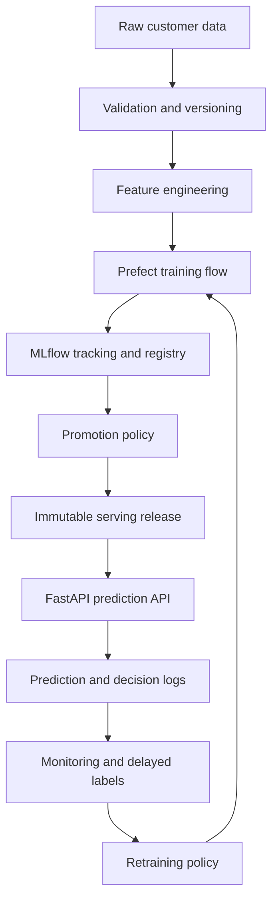
```mermaid
flowchart TB
    A[Raw customer data] --> B[Validation and versioning]
    B --> C[Feature engineering]
    C --> D[Prefect training flow]
    D --> E[MLflow tracking and registry]
    E --> F[Promotion policy]
    F --> G[Immutable serving release]
    G --> H[FastAPI prediction API]
    H --> I[Prediction and decision logs]
    I --> J[Monitoring and delayed labels]
    J --> K[Retraining policy]
    K --> D
```

The serving API does not independently assemble model artifacts at request time. It loads a validated release that binds the model version, feature schema, decision threshold and lineage metadata into one deployable unit.

---

## 📦 Atomic Serving Releases

Every deployable model is represented by an immutable release manifest. A release includes references and checksums for the artifacts required during inference, including:

- registered model name and version
- MLflow run ID and immutable model URI
- model type
- decision threshold
- feature schema
- prediction probe
- dataset version
- configuration hash
- Git commit

<p align="center">
  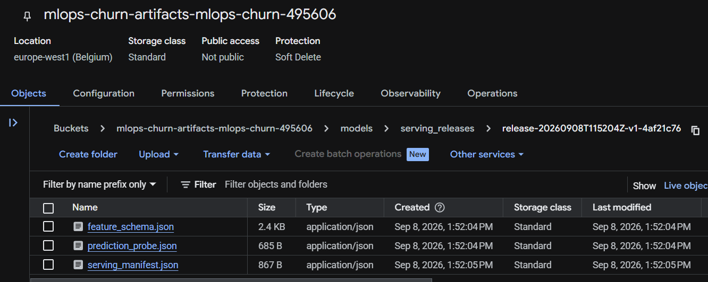
</p>

<p align="center">
  <em>
    Immutable production serving release containing the feature schema,
    semantic prediction probe and versioned serving manifest.
  </em>
</p>

The API validates the complete bundle before replacing the active serving state. A failed reload therefore keeps the previous working bundle active.

This prevents partial deployments such as:

- new model with old feature schema
- updated threshold with old model
- missing or corrupted serving artifact
- alias changes during model loading

Serving releases can be inspected and rolled back without rebuilding the API image.

---

## 🔌 API and Decision Service

The FastAPI service supports:

- single and batch churn prediction
- authenticated requests via `X-API-KEY`
- customer IDs in decision responses
- configurable decision thresholds
- customer-value estimation
- expected-value-based retention actions
- customer prioritization
- campaign simulation
- prediction explanations
- structured lineage and timing metadata
- liveness and readiness probes
- Prometheus metrics
- administrative model reload and serving rollback

Example response:

```json
{
  "predictions": [
    {
      "customer_id": "7590-VHVEG",
      "churn_probability": 0.52,
      "customer_value": 358.2,
      "action": "offer_discount",
      "expected_value": 46.08
    }
  ],
  "status": "success",
  "metadata": {
    "model_name": "churn-prediction-model",
    "serving_alias": "champion",
    "release_id": "release-...",
    "model_version": "1"
  }
}
```

<p align="center">
  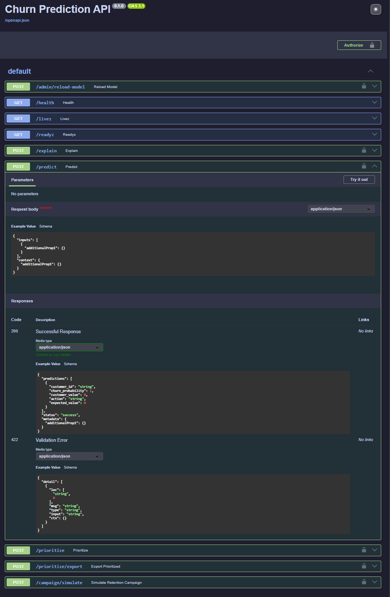
</p>

---

## 💰 Business Decision Logic

The API translates probabilities into retention decisions instead of returning only raw model scores.

Each action can incorporate:

- churn probability
- estimated customer value
- intervention cost
- expected uplift
- minimum expected profit
- campaign budget

Example configuration:

```yaml
customer_value: 100
cost_discount: 10
cost_contact: 2
discount_uplift: 0.3
contact_uplift: 0.1
min_expected_profit: 0.0
```

The decision engine supports actions such as `offer_discount`, `send_email` and `no_action`. Batch prioritization selects the most valuable interventions under the configured policy and budget.

---

## 🔁 Training, Evaluation and Promotion

Training and retraining are orchestrated with Prefect. The flow covers:

1. drift and retraining checks
2. raw-data preparation and validation
3. dataset snapshot creation
4. feature engineering
5. model training and MLflow logging
6. classification evaluation
7. Champion/challenger decision
8. serving-release publication
9. API refresh and readiness verification

The first Champion is created explicitly with a bootstrap run. Later forced or monitoring-triggered runs follow the normal promotion policy.

A Challenger is evaluated primarily on recent labeled production data. Promotion requires a configurable business-value improvement while F1, recall, ROC AUC and Brier score remain within their permitted regression limits. A separate reference-validation evaluation acts as a safety guard against excessive degradation on the original data distribution.

Retraining and promotion are intentionally separate decisions: monitoring may trigger and execute a training run without replacing the active Champion.

<p align="center">
  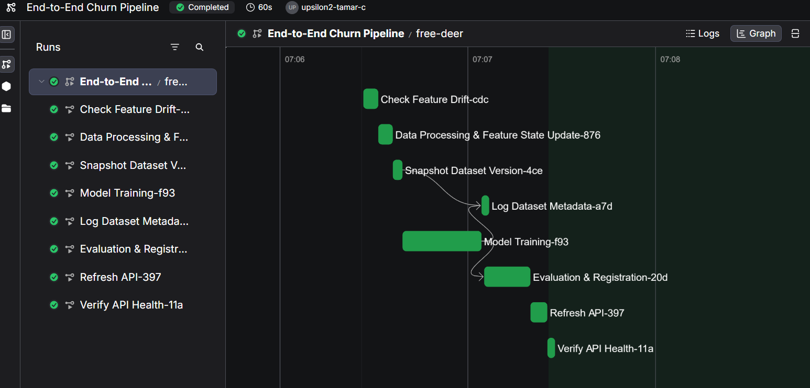
</p>

---

## 📊 Experiment Tracking and Lineage

MLflow tracks parameters, metrics, artifacts and model lineage. Classification metrics include, where applicable:

- accuracy
- precision
- recall
- F1 score
- ROC AUC
- Brier score
- decision threshold
- business-value metrics

Dataset versions, configuration hashes and Git commits connect each registered model and serving release to the code and data used to create it.

The screenshots below show the verified production lifecycle. MLflow stores
experiment and registry metadata in Cloud SQL for PostgreSQL, while model
artifacts remain in Google Cloud Storage. The registered production model uses
a versioned `champion` alias and retains its run lineage across Cloud Run
revision replacement.

<p align="center">
  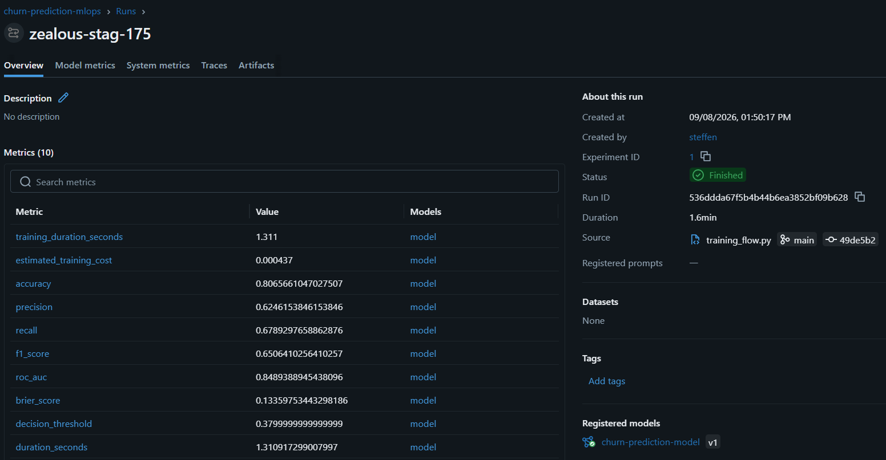
</p>

<p align="center">
  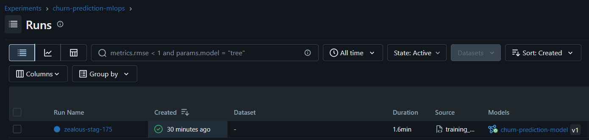
</p>

<p align="center">
  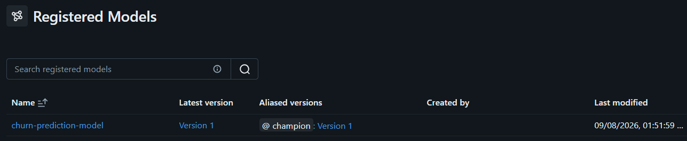
</p>

---

## 📈 Monitoring and Observability

The monitoring layer combines ML, business and service-level signals.

### ML monitoring

- runtime data-quality checks
- feature-distribution drift
- delayed ground-truth ingestion
- rolling classification performance
- Champion degradation detection
- retraining eligibility and cooldown state

The Streamlit lifecycle dashboard combines current inference activity with
label-dependent model and business outcomes. Prediction volume, active decision
thresholds and retention actions cover all logged predictions, while
classification performance and realized business metrics are calculated only
after delayed labels become available.

Retraining executions and successful Champion promotions are shown as separate
events. This makes it possible to distinguish model training from the governed
decision to replace the active production model.

The dashboard screenshot was captured from the local controlled lifecycle
experiment. The same monitoring code supports filesystem-backed local runs and
GCS-backed production data through the project's storage abstraction.

<p align="center">
  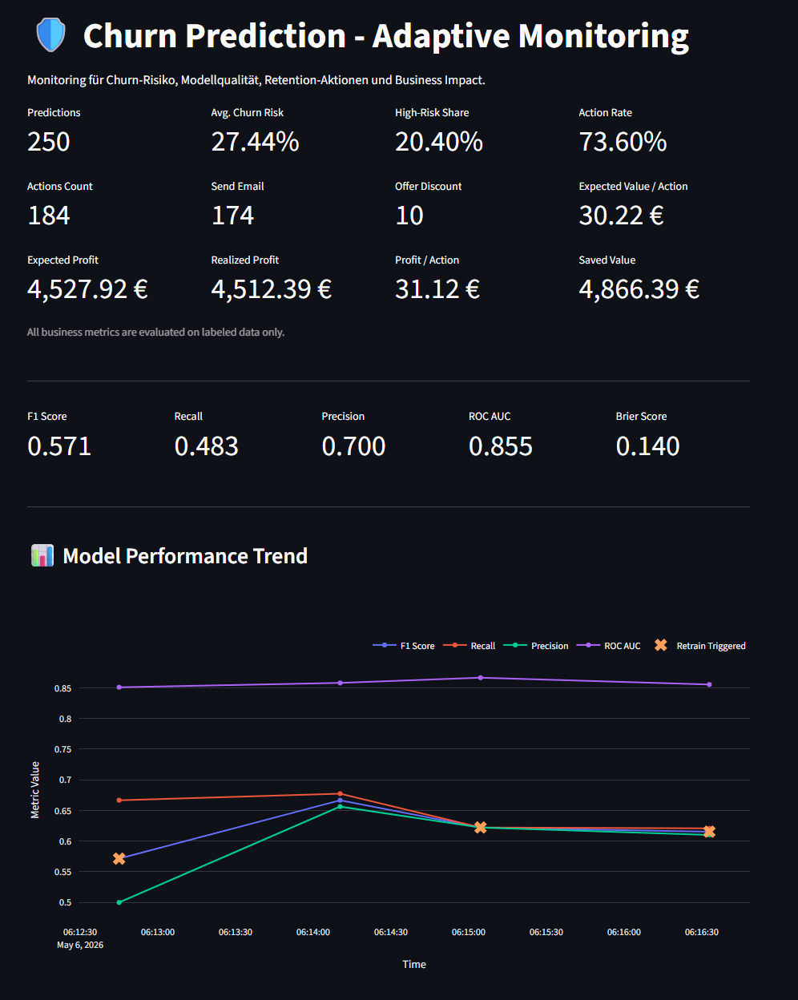
</p>

### Business monitoring and policy analysis

Business monitoring covers:

- churn-risk distribution
- retention-action distribution
- expected and realized net profit
- gross saved value and intervention costs
- expected and realized profit per labeled action
- sensitivity of action selection to minimum-profit requirements

The business-policy view separates model predictions from the downstream
decision policy. It shows how predicted churn probabilities translate into
retention actions and how increasing the minimum required profit per action
changes both the selected action volume and the simulated portfolio profit.

<p align="center">
  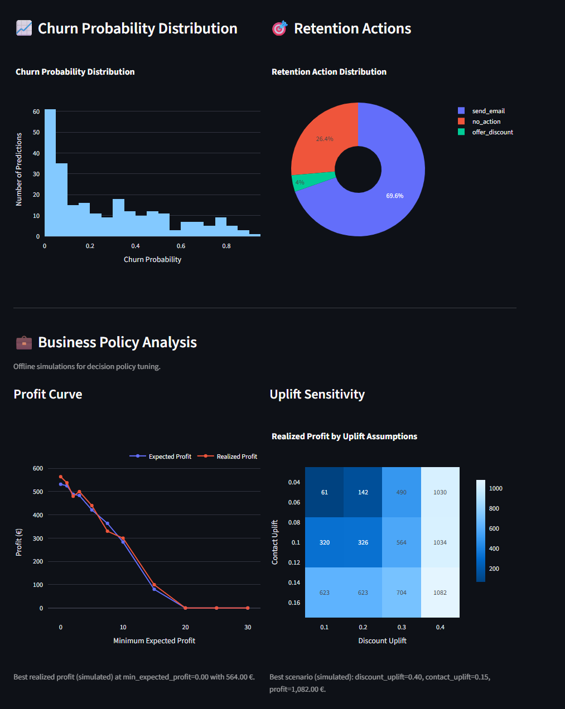
</p>

> Business outcomes are simulated using configured customer values,
> intervention costs and uplift assumptions. They demonstrate policy
> evaluation and monitoring mechanics rather than observed causal effects from
> a real retention campaign.

### API and SLO monitoring

- serving readiness
- request throughput
- p50, p95 and p99 latency
- HTTP 5xx rate
- service availability

Prometheus evaluates alert rules for API availability, serving-bundle
readiness, prediction latency and server-error rate. Alertmanager forwards
notifications to the internal receiver, which can optionally deliver them to
Slack. Grafana provides the operational SLO view independently from the
model- and business-monitoring dashboard.

<p align="center">
  
</p>

---

## 🕒 Delayed Labels and Guarded Retraining

Predictions are available immediately, while actual churn outcomes may only arrive later. The demo lifecycle reproduces this operational constraint by:

- logging predictions at inference time
- retaining pending outcomes
- releasing labels after a configured delay
- joining outcomes with previous predictions
- recomputing performance history
- evaluating retraining signals

Retraining safeguards include:

- minimum labeled sample count
- evaluation over recent production windows
- persistent degradation signals
- cooldown after retraining
- drift-aware execution
- idempotent retraining decisions
- business-value-based Champion/challenger evaluation
- classification non-regression gates
- separate reference-validation safety gates
- atomic serving-release publication after promotion

Retraining execution does not imply deployment. A candidate becomes the new
Champion only after passing the recent-production promotion policy and the
reference-validation safety gates. All thresholds are configuration-driven.


---

## 🧪 Controlled Retraining Experiments

The retraining workflow is evaluated through two reproducible experiments.
Both branches process the same ordered customer observations and delayed
labels. The only experimental difference is whether automatic retraining is
enabled.

Performance is shown as rolling F1 over the latest 150 released labels.
Business impact is reported as cumulative simulated profit uplift of the
adaptive branch relative to the static branch.

The controlled experiments run against the local Docker Compose stack so that
both branches can be reset, replayed and compared deterministically without
incurring cloud infrastructure costs. Cloud deployment and production
verification are validated separately through Terraform and the CI/CD
workflow.

### Controlled concept drift: adaptation after promotion

This experiment keeps the real Telco customer features unchanged and applies
a controlled synthetic target shift to a documented customer cohort. Every
modified label is recorded in a separate audit artifact, and both experiment
branches use the same customer sequence and effective labels.

Across the 28-day simulation:

- 83 target labels were changed by the controlled drift process
- 4 retraining runs were executed
- 2 candidates passed the promotion policy
- post-shift mean rolling F1 increased from `0.564` to `0.579`
- final simulated realized profit increased from `€32,132` to `€32,216`
- the adaptive branch produced a cumulative simulated profit uplift of `€84`

<p align="center">
  
</p>

The result illustrates that retraining does not need to outperform the static
model in every individual evaluation window. Its benefit is evaluated across
recent production evidence, business value and reference-distribution safety
constraints.

### Customer-cohort shift: retraining without promotion

The complementary cohort-shift experiment changes only the composition of
incoming customers. It uses real Telco customer features and labels without
synthetic feature or target values.

Monitoring executed two retraining runs, but neither candidate passed the
promotion policy. The active Champion therefore remained unchanged, and the
static and retraining-enabled branches produced identical model performance
and business results.

<p align="center">
  
</p>

Together, the experiments demonstrate both outcomes required from a guarded
retraining system: adaptation when a candidate provides sufficient evidence
of improvement, and rejection when a newer model does not justify replacing
the production Champion.

> Business value is simulated using the configured retention costs, customer
> value and intervention-uplift assumptions. The concept-drift experiment
> modifies target labels only within an explicitly defined and audited cohort;
> it does not claim observed causal retention effects.


---

## 🚀 CI/CD and Cloud Deployment

GitHub Actions validates and deploys the project on pushes to `main`.

The pipeline includes:

- Ruff linting
- unit and integration tests
- API smoke tests
- Terraform validation and planning
- API and MLflow image builds
- Trivy vulnerability scanning
- Artifact Registry publishing
- Cloud Run deployment
- Workload Identity Federation authentication

The API image is deployed with an immutable Git SHA tag. Infrastructure is managed through Terraform.

Cloud build and deployment jobs are gated by the GitHub repository variable
`DEPLOY_GCP`. Linting, tests and the local API smoke test continue to run while
cloud deployment is disabled.

Enable cloud deployment only after Terraform has provisioned the required
resources:

```bash
gh variable set DEPLOY_GCP --body true
```

Disable it before destroying the infrastructure:

```bash
gh variable set DEPLOY_GCP --body false
```

<p align="center">
  
</p>

<p align="center">
  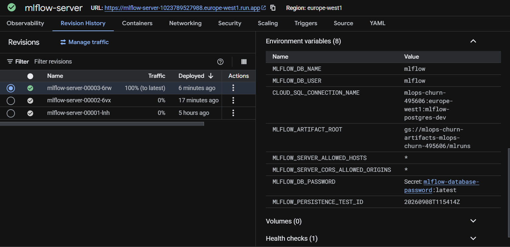
</p>

<p align="center">
  <em>
    MLflow on Cloud Run using Cloud SQL for persistent tracking metadata,
    Secret Manager for database credentials and GCS for model artifacts.
  </em>
</p>
---

## 🔒 Security and Reliability

- API-key-protected inference endpoints
- non-root application containers
- Workload Identity Federation instead of static CI credentials
- container vulnerability scans
- immutable container tags
- health and readiness probes
- checksummed serving artifacts
- transactional serving-state replacement
- rollback to a previous validated release
- configuration separation between local and production environments

---

## ☁️ Technology Stack

### ML and application

- Python 3.12
- pandas
- scikit-learn and XGBoost
- FastAPI and Uvicorn
- MLflow
- Prefect
- Pandera

### Platform and operations

- Docker and Docker Compose
- PostgreSQL
- Cloud SQL for PostgreSQL
- Google Secret Manager
- Prometheus
- Grafana
- Alertmanager
- Streamlit
- GitHub Actions
- Trivy
- Terraform
- Google Cloud Run
- Google Artifact Registry
- Google Cloud Storage

---

## 📁 Project Structure

```text
.
├── configs/                 # environment, training and monitoring configuration
├── data/                    # local raw and generated lifecycle data
├── docs/                    # architecture and operating documentation
├── flows/                   # Prefect flows and reusable tasks
├── infrastructure/          # Terraform configuration
├── monitoring/              # Prometheus, Alertmanager and Grafana configuration
├── scripts/                 # demos, verification and operational helpers
├── src/
│   ├── api/                 # FastAPI contracts and endpoints
│   ├── data/                # validation, features and versioning
│   ├── deployment/          # cloud deployment helpers
│   ├── inference/           # model loading, decisions and serving releases
│   ├── monitoring/          # ML, business and service monitoring
│   ├── storage/             # filesystem and cloud storage abstractions
│   └── training/            # training, evaluation and registration
├── tests/                   # unit and integration tests
├── docker-compose.yml
├── Makefile
└── pyproject.toml
```

---

## ⚡ Local Quick Start

### 1. Clone and configure

```bash
git clone https://github.com/SL14-SL/mlops-churn-prediction.git
cd mlops-churn-prediction
cp .env.example .env
```

Set at least a local `API_KEY` in `.env`. Raw source data is intentionally
excluded from Git. Download the
[Telco Customer Churn dataset from Kaggle](https://www.kaggle.com/datasets/blastchar/telco-customer-churn),
rename the downloaded CSV file to `Telco-Customer-Churn.csv` if necessary, and
place it under `data/raw/`.

### 2. Create the environment

```bash
make setup
source .venv/bin/activate
```

### 3. Start local services

```bash
make dev-up
make wait-prefect
```

| Service | URL |
|---|---|
| Forecasting API | http://localhost:8000 |
| Swagger UI | http://localhost:8000/docs |
| Streamlit | http://localhost:8501 |
| MLflow | http://localhost:5000 |
| Prefect | http://localhost:4221 |
| Grafana | http://localhost:3000 |
| Prometheus | http://localhost:9090 |
| Alertmanager | http://localhost:9093 |


### 4. Bootstrap the first local Champion

Use the bootstrap target only when the local MLflow registry is empty:

```bash
make train-bootstrap
```

For later forced training runs:

```bash
make train-force
```

### 5. Verify local serving

```bash
curl -fsS http://localhost:8000/livez | jq .
curl -fsS http://localhost:8000/readyz | jq .
make predict-test
```

### 6. Run quality checks

```bash
make check
```
This runs Ruff, the unit and integration test suite, and Docker Compose
configuration validation.

### 7. Register local Prefect automation

```bash
make prefect-pool
make prefect-setup
make prefect-worker
```

Local Prefect uses `http://localhost:4200/api`. Production flow targets use the Prefect Cloud URL and API key from `.env`; the two configurations are intentionally separated.

### Useful lifecycle commands

| Command | Purpose |
|---|---|
| `make dev-up` | Build and start the complete local stack |
| `make dev-down` | Stop the local stack |
| `make train-bootstrap` | Create the initial Champion and serving release |
| `make train` | Run normal training when the pre-training policy permits it |
| `make train-force` | Force candidate training and evaluation |
| `make auto-retrain` | Evaluate the retraining policy once |
| `make predict-test` | Send an authenticated local prediction request |
| `make demo-churn-lifecycle` | Run the delayed-label churn lifecycle demo |
| `make rollback-serving RELEASE_ID=<id>` | Activate a previous validated serving release |
| `make dashboard-logs` | Follow Streamlit dashboard logs |
| `make check` | Run linting, tests and Compose validation |
| `make reset-demo` | Remove generated demo state while retaining raw input data |
| `make reset-local-stack CONFIRM_RESET=1` | Delete all local runtime and serving state |

Local serving release IDs are stored below `models/serving_releases/`. The
active release pointer is stored in `models/active_serving_release.json`.


---

## 🧪 Churn Lifecycle Demo

After the local stack and initial Champion are available:

```bash
make demo-churn-lifecycle
```

The demo simulates prediction batches, delayed labels, monitoring refreshes and retraining decisions.

Controlled retraining experiments can be reproduced separately:

```bash
make churn-cohort-shift-comparison
make churn-cohort-shift-comparison-plot

make churn-concept-drift-comparison
make churn-concept-drift-comparison-plot
```
Experiment artifacts, manifests, audit tables and comparison summaries are
written below `results/churn_retraining_comparison/`.
---

## ☁️ Production Bootstrap and Verification

Production infrastructure is provisioned with Terraform:

```bash
terraform -chdir=infrastructure init
terraform -chdir=infrastructure fmt -check
terraform -chdir=infrastructure validate
terraform -chdir=infrastructure plan
terraform -chdir=infrastructure apply
```

### Cost-conscious persistent MLflow backend

The Google Cloud demonstration uses a persistent MLflow architecture:

- MLflow runs as a Cloud Run service;
- experiment, run and registry metadata are stored in Cloud SQL for PostgreSQL;
- model artifacts are stored in Google Cloud Storage;
- immutable serving releases are stored separately in GCS;
- the database password is supplied through Secret Manager;
- Cloud Run can scale to zero and is limited to one MLflow instance.

This keeps the registered model, `champion` alias and run metadata available
across Cloud Run instance termination and revision replacement. Persistence was
verified by deploying a new MLflow revision and confirming that the same model
version, run ID and GCS artifact URI remained available.

Cloud SQL is the main continuously billable component. The infrastructure is
therefore provisioned only for the production demonstration and destroyed after
the verification evidence has been captured.

<p align="center">
  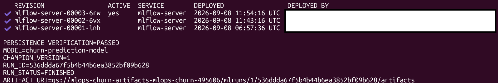
</p>

<p align="center">
  <em>
    Registered churn model, champion version, completed run and GCS artifact
    location verified after replacing the MLflow Cloud Run revision.
  </em>
</p>

Required production values are loaded from `.env`, GitHub Variables and GitHub Secrets. Validate the non-secret configuration locally:

```bash
make debug-prod-env
make check-prod-env
```

For an empty production registry:

```bash
make train-bootstrap-prod
```

For later forced production training:

```bash
make train-force-prod
```

Verify the deployed API:

```bash
make predict-test-prod
```

Or inspect the probes directly:

```bash
API_URL="$(terraform -chdir=infrastructure output -raw prediction_api_url)"

curl -fsS "$API_URL/livez" | jq .
curl -fsS "$API_URL/readyz" | jq .
curl -fsS "$API_URL/health" | jq .
```

`train-bootstrap-prod` is intended only for a fresh production registry. Once a
Champion exists, use the normal production training path.

A new MLflow Cloud Run revision does not require another bootstrap because
registry metadata is stored persistently in Cloud SQL. Bootstrap remains
reserved for an empty production registry.

---

## 📈 Main API Endpoints

| Method | Path | Purpose |
|---|---|---|
| `GET` | `/livez` | Process liveness |
| `GET` | `/readyz` | Complete serving-bundle readiness and lineage |
| `GET` | `/health` | Service and active model status |
| `GET` | `/metrics` | Prometheus metrics |
| `POST` | `/predict` | Churn prediction and retention decision |
| `POST` | `/prioritize` | Rank customers by decision value |
| `POST` | `/prioritize/export` | Export prioritized customers |
| `POST` | `/campaign/simulate` | Simulate retention campaign impact |
| `POST` | `/explain` | Explain an individual prediction |
| `POST` | `/admin/reload-model` | Reload active serving state |
| `POST` | `/admin/rollback-serving-release` | Activate a previous serving release |

Interactive OpenAPI documentation is available under `/docs`.

---

## 🔧 Configuration

The platform uses environment-specific and domain-specific configuration files, including:

- `configs/dev.yaml`
- `configs/staging.yaml`
- `configs/prod.yaml`
- `configs/gcp.yaml`
- `configs/training.yaml`
- monitoring and decision-policy configuration

Runtime environment selection:

```bash
APP_ENV=dev
APP_ENV=prod
```

Secrets such as `API_KEY`, `PREFECT_API_KEY` and optional Slack webhooks must not be committed.

---

## 📚 Documentation

Detailed architecture and operational documentation is available in:

- [System architecture](docs/architecture.md)
- [Local development](docs/local-development.md)
- [Google Cloud production demo](docs/production-demo.md)
- [Serving releases and rollback](docs/serving-releases.md)
- [Automatic retraining policy](docs/retraining-policy.md)
- [Monitoring, SLOs and alerting](docs/monitoring-and-slos.md)
- [Incident response runbook](docs/operations-runbook.md)

---

## 📦 Dataset

The project uses the
[Telco Customer Churn dataset](https://www.kaggle.com/datasets/blastchar/telco-customer-churn)
available through Kaggle as a realistic binary-classification and
retention-decisioning scenario.

The source file must be placed at:

```text
data/raw/Telco-Customer-Churn.csv
```

Raw dataset files are intentionally excluded from version control. Users are
responsible for obtaining the dataset from an authorized source and complying
with its original license and usage conditions.

The dataset is a vehicle for demonstrating reusable MLOps patterns rather than
the central deliverable. The architecture can be adapted to other supervised
decisioning systems such as:

- lead scoring
- conversion prediction
- subscription cancellation prediction
- upsell propensity
- fraud or risk scoring
- support escalation prediction

## ⚠️ Scope and Limitations

This repository is a production-oriented portfolio blueprint, not a fully managed enterprise platform.

For a regulated or large-scale deployment, further controls may include:

- private networking and authenticated Cloud Run ingress
- automated Cloud SQL backup and disaster-recovery verification
- centralized secret rotation
- organization-wide audit logging
- formal privacy and retention policies
- autoscaling and sustained load tests
- multi-region recovery objectives
- staged traffic splitting or shadow deployment

The current cloud setup intentionally favors a compact, reproducible
demonstration while implementing the central safety patterns of a production ML
lifecycle. MLflow metadata is persisted in Cloud SQL and model artifacts are
stored in GCS. The infrastructure is nevertheless operated temporarily to limit
ongoing costs and is not presented as a continuously operated enterprise
platform.

---

## 📄 License

MIT License

---

## 👨‍💻 Author

**Steffen Lauterbach**  
MLOps Engineer

Focused on production-oriented ML systems, safe model deployment, monitoring,
retraining workflows and cloud-native infrastructure.

[LinkedIn](https://www.linkedin.com/in/92-steffen-lauterbach)
