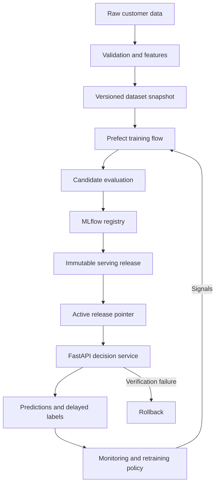
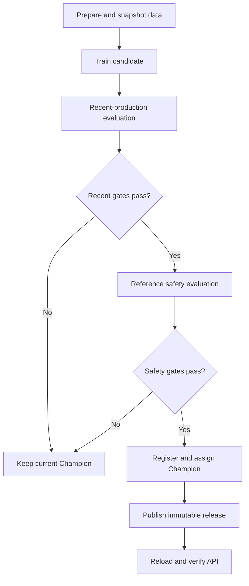
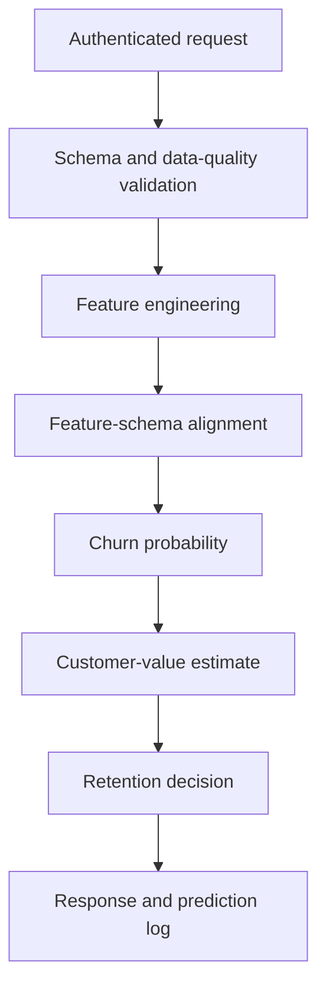

# System Architecture

## Purpose

This document describes the runtime components, ownership boundaries and data
flows of the customer-churn platform. Training, model selection, release
publication and online serving are separated so they can be tested and operated
independently.

## High-Level Architecture

## Component Responsibilities

| Component | Responsibility | Persistent information |
|---|---|---|
| Data pipeline | Schema validation, preprocessing and feature construction | Validated data and feature tables |
| Dataset versioning | Stable dataset identity and lineage metadata | Dataset snapshots and metadata |
| Prefect | Training and retraining orchestration | Flow and task-run metadata |
| MLflow | Experiments, metrics and registered model versions | Cloud SQL metadata and GCS artifacts |
| Cloud SQL | Persistent PostgreSQL backend for MLflow | Experiments, runs, model versions and aliases |
| GCS | MLflow artifacts, datasets and immutable serving releases | Versioned objects |
| Secret Manager | Supplies the MLflow database password | Versioned database credential |
| Serving release storage | Immutable manifests and inference artifacts | Versioned release directories and active pointer |
| FastAPI | Request validation, inference and business decisions | Process-local active `ServingBundle` |
| Prediction logger | Prediction, lineage and decision logging | Current log and date-partitioned history |
| ML monitoring | Data quality, drift and delayed-label performance | Monitoring history and retraining state |
| Prometheus | Runtime metric collection and alert-rule evaluation | Time-series metrics |
| Grafana | SLO and service visualization | Provisioned dashboards |
| Alertmanager | Alert grouping and routing | Alert state |
| Terraform | Google Cloud resource definitions | Terraform state |
| GitHub Actions | Validation, scanning, image publication and deployment | Workflow history |

## Internal Code Boundaries

| Layer | Main modules | Responsibility |
|---|---|---|
| Flow orchestration | `flows/training_flow.py`, `flows/auto_retrain_flow.py` | Coordinate lifecycle steps |
| Deployment orchestration | `flows/deployment_flow.py`, `flows/tasks/serving_tasks.py` | Publish, reload, verify and roll back releases |
| HTTP transport | `src/api/app.py`, `src/api/schema.py` | Endpoints, authentication and response contracts |
| API services | `src/api/services.py` | Shared pipeline invocation and business-result helpers |
| Inference | `src/inference/pipeline.py`, `src/inference/adapters.py` | Feature alignment and model execution |
| Decisioning | `src/inference/decision.py` | Retention action and expected-value policy |
| Serving state | `src/inference/serving_bundle.py`, `src/inference/model_manager.py` | Load and validate one complete bundle |
| Release lifecycle | `src/inference/releases/` | Manifests, storage, publication and active-pointer operations |
| Training | `src/training/` | Training, evaluation, explainability and registration |
| Monitoring | `src/monitoring/` | Data quality, drift, delayed labels, costs and retraining signals |
| Storage | `src/storage/` | Local and cloud filesystem operations |

## Training and Promotion Flow

Recent labeled production data is the primary promotion dataset when available.
The policy optimizes recent business value while enforcing configurable
non-regression tolerances for classification quality. Reference validation is a
separate safety layer protecting the original data distribution.

Retraining execution and Champion promotion are intentionally separate
lifecycle events.

`--force` bypasses the pre-training decision to skip a run. It does not bypass
the Champion/challenger promotion policy. A fresh registry requires the
explicit `--bootstrap` path.

## Serving Architecture

MLflow and serving-release storage have different responsibilities:

- MLflow is the source of truth for experiments and registered model versions.
- A serving release fixes the exact numeric model version, feature schema,
  decision threshold and prediction probe.
- The active pointer selects one complete release.
- The API replaces its in-memory bundle only after the new bundle has loaded
  and validated successfully.

This prevents mixed states such as a new model with an old schema or an updated
decision threshold with stale model metadata.

The `/readyz`, `/health`, `/metrics` and prediction routes all reflect the same
active bundle. A failed reload leaves the previous bundle available.

## Prediction and Decision Flow

Customer identifiers are retained for response and monitoring lineage but are
not used as predictive model features.

## Environment Topology

### Local development

Docker Compose starts:

- FastAPI;
- PostgreSQL;
- MLflow;
- Prefect server;
- Prometheus;
- Grafana;
- Alertmanager and the local alert receiver.

The Streamlit dashboard can also be exposed by the project stack. Local runtime
directories hold data, models, monitoring output and serving releases.

### Google Cloud demonstration

The cloud demonstration uses:

- Cloud Run for MLflow and `churn-prediction-api`;
- Cloud SQL for PostgreSQL as the persistent MLflow tracking backend;
- Secret Manager for the MLflow database password;
- Artifact Registry for container images;
- GCS for raw data, MLflow artifacts, dataset snapshots and serving releases;
- Prefect Cloud for production flow observability;
- Terraform for provisioning;
- GitHub Actions with Workload Identity Federation for deployment.

MLflow stores experiment, run, registered-model and alias metadata in Cloud
SQL. Model artifacts remain in GCS. This separation keeps the production
registry persistent across Cloud Run instance termination, scale-to-zero and
revision replacement.

The MLflow Cloud Run service is limited to one instance and can scale to zero.
Cloud SQL remains the main continuously billable component and is provisioned
only for the duration of the production demonstration.

  

  <em>
    MLflow on Cloud Run with Cloud SQL metadata, Secret Manager credentials
    and GCS artifact storage.
  </em>

## Trust Boundaries

| Boundary | Control |
|---|---|
| Client to API | API key and Pydantic request validation |
| GitHub Actions to GCP | Workload Identity Federation |
| API/training process to GCS | Service account and bucket IAM |
| Release activation | Manifest validation, path containment and checksums |
| Model replacement | Load-before-swap bundle activation |
| Deployment completion | Readiness and semantic prediction verification |
| Failed deployment | Active-pointer restoration and reload |

## Reusable and Domain-Specific Layers

Reusable infrastructure includes orchestration, registry integration, serving
releases, health checks, monitoring, rollback, CI/CD and Terraform.

Churn-specific code includes the request fields, classification metrics,
decision threshold, customer-value estimation, retention actions, delayed-label
evaluation and promotion thresholds. These layers are deliberately isolated
from the reusable operational architecture.

## Related Documentation

- [Local development](local-development.md)
- [Production demo](production-demo.md)
- [Serving releases](serving-releases.md)
- [Retraining policy](retraining-policy.md)
- [Monitoring and SLOs](monitoring-and-slos.md)
- [Operations runbook](operations-runbook.md)

