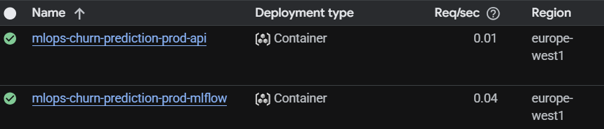
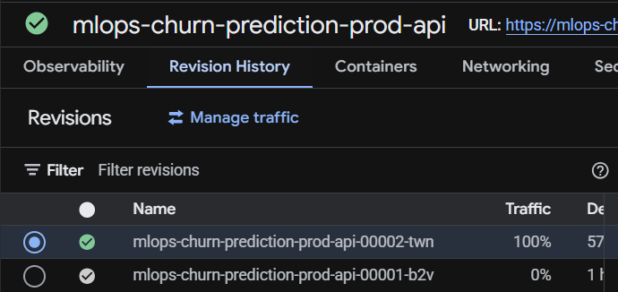
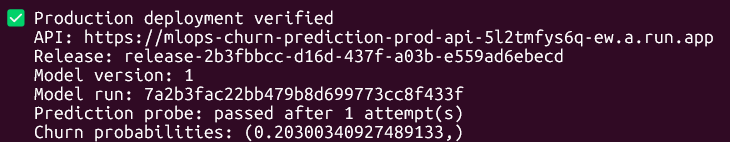
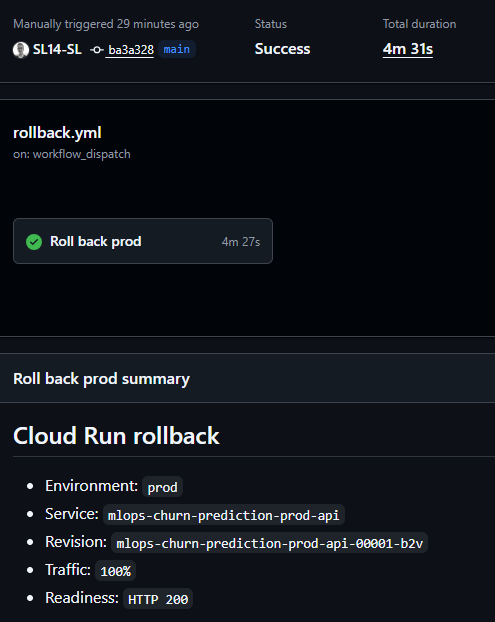
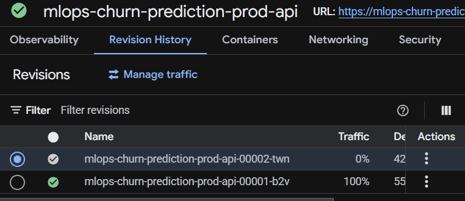

# Google Cloud Deployment

This guide covers Terraform bootstrap, GitHub Actions deployment, authenticated
MLflow access, production model bootstrap, verification and revision rollback.
The demonstrated production deployment was verified on 6 October 2026 and then
fully torn down. Screenshots document that run; the pictured URLs are not live.

## Managed Architecture

| Resource | Role |
|---|---|
| Bootstrap GCS bucket | Versioned remote Terraform state |
| Workload Identity Federation | Keyless GitHub Actions authentication |
| Artifact Registry | API and MLflow images tagged with the Git SHA |
| Cloud Run API | Churn inference and retention decisions |
| Private Cloud Run MLflow | Experiment tracking and model registry |
| Cloud SQL PostgreSQL | Persistent MLflow metadata |
| GCS artifact bucket | Datasets, releases, schemas and MLflow artifacts |
| Secret Manager | API key and MLflow database password |
| Dedicated service accounts | API, MLflow, training and deployment identities |

The API loads the active serving manifest from GCS and the exact numeric model
version from MLflow during startup or reload. Predictions use the loaded
in-memory bundle. This is not a portable model export that eliminates the
runtime MLflow dependency.

MLflow is private even when the demonstration API permits unauthenticated
network access. Authorized API and training identities use the
`mlflow-cloud-run-auth` plugin to obtain renewable identity tokens. MLflow uses
its service account to access GCS and connects to PostgreSQL through the Cloud
SQL connection. Prefect Cloud remains an external orchestration service.

Streamlit, Prometheus, Grafana and Alertmanager run in the local Compose stack;
the current Terraform deployment does not provision those dashboards in GCP.

<p align="center">
  
</p>

## Prerequisites

Install Google Cloud CLI, Terraform, Docker, GitHub CLI, Python 3.12 and `uv`.
Use a billing-enabled Google Cloud project and the existing project repository.

```bash
gcloud auth login
gcloud auth application-default login
uv sync --frozen

gcloud config set project YOUR_GCP_PROJECT_ID
```

The operator needs permissions to provision resources, configure IAM and
impersonate the training identity. Keep local Terraform state, `.env` and
`terraform.tfvars` outside version control.

## Bootstrap State and GitHub Authentication

```bash
cp infrastructure/terraform-bootstrap/terraform.tfvars.example \
  infrastructure/terraform-bootstrap/terraform.tfvars
```

Set the actual project and exact repository in that file:

```hcl
gcp_project_id   = "your-gcp-project-id"
storage_location = "EU"
enable_github_actions = true
github_repository_owner = "your-github-owner"
github_repository_name  = "mlops-churn-prediction"
```

```bash
terraform -chdir=infrastructure/terraform-bootstrap init
terraform -chdir=infrastructure/terraform-bootstrap plan
terraform -chdir=infrastructure/terraform-bootstrap apply
terraform -chdir=infrastructure/terraform-bootstrap output
```

Bootstrap uses local Terraform state. Retain it for future updates and teardown.
It creates the protected state bucket, deployment identity, Workload Identity
Pool/provider and IAM bindings. The application module uses GCS state with
prefix `mlops-churn-prediction/<environment>` and the default workspace.

## Configure GitHub Variables and Secrets

Read the bootstrap outputs:

```bash
TF_STATE_BUCKET="$(terraform -chdir=infrastructure/terraform-bootstrap output -raw terraform_state_bucket)"
WIF_PROVIDER="$(terraform -chdir=infrastructure/terraform-bootstrap output -raw github_workload_identity_provider)"
DEPLOY_SERVICE_ACCOUNT="$(terraform -chdir=infrastructure/terraform-bootstrap output -raw github_deployer_service_account)"

gh variable set GCP_PROJECT_ID --body "your-gcp-project-id"
gh variable set GCP_REGION --body "europe-west1"
gh variable set ARTIFACT_REGISTRY_REPOSITORY --body "mlops-churn-prediction-images"
gh variable set GCP_WORKLOAD_IDENTITY_PROVIDER --body "$WIF_PROVIDER"
gh variable set GCP_DEPLOY_SERVICE_ACCOUNT --body "$DEPLOY_SERVICE_ACCOUNT"
gh variable set TF_STATE_BUCKET --body "$TF_STATE_BUCKET"
gh variable set GCS_STORAGE_LOCATION --body "EU"
gh variable set ALLOW_UNAUTHENTICATED --body "false"
```

Create deployment environments:

```bash
for environment in dev staging prod; do
  gh api --method PUT "repos/{owner}/{repo}/environments/${environment}"
done
```

For the environment being deployed, configure its secrets using interactive
prompts:

```bash
gh secret set API_KEY --env prod
gh secret set MLFLOW_DATABASE_PASSWORD --env prod
```

Use a strong database password and retain the same value for later deployments;
the workflow configures the database user and publishes its Secret Manager
version. Do not casually replace it while MLflow instances use the old value.

Set `TRAINING_OPERATOR_EMAIL` to the operator permitted to impersonate the
training service account, and configure the Prefect Cloud API URL:

```bash
gh variable set TRAINING_OPERATOR_EMAIL --env prod --body "your-operator@example.com"
gh variable set PREFECT_API_URL --env prod --body "https://api.prefect.cloud/api/accounts/ACCOUNT_ID/workspaces/WORKSPACE_ID"
```

The Terraform-managed MLflow service supplies the API's tracking endpoint. An
external `MLFLOW_TRACKING_URI` is not required for the demonstrated managed
setup. Production training uses the Prefect API key from local `.env`.

An optional `CLOUD_RUN_SERVICE_NAME` override must match the API service used by
`rollback.yml`. Otherwise the workflow derives
`mlops-churn-prediction-<environment>-api` from the repository name.

## Plan Without Applying

Commit and push the intended source before starting a workflow; it checks out
the selected Git revision, not uncommitted local files.

```bash
gh workflow run deploy.yml --field environment=prod --field apply_changes=false
gh run list --workflow deploy.yml --limit 5
gh run watch RUN_ID

gh run download RUN_ID --pattern 'terraform-plan-prod-*' --dir /tmp/churn-prod-plan
find /tmp/churn-prod-plan -type f -name 'deployment-plan.txt' \
  -exec grep -nE 'will be created|will be updated|must be replaced|will be destroyed|Plan:' {} +
```

The downloaded artifact contains a nested directory. Review the complete plan,
including IAM, SQL settings and service configuration. Planning-only runs do
not apply foundational infrastructure, configure secrets or publish images.
The apply run creates a fresh plan for the same selected source revision.

## Apply the Deployment

```bash
gh workflow run deploy.yml --field environment=prod --field apply_changes=true
gh run list --workflow deploy.yml --limit 5
gh run watch RUN_ID
```

With changes enabled, the workflow:

1. initializes the environment's remote state and validates Terraform;
2. plans and applies foundational resources, including Cloud SQL;
3. configures the MLflow database user and publishes database/API secrets;
4. builds and pushes API and MLflow images tagged with the Git commit SHA;
5. creates and uploads a readable Cloud Run plan;
6. rejects destructive Cloud Run changes;
7. applies the reviewed-in-run plan and checks Cloud Run service readiness.

GitHub Environment reviewers can be configured as an additional deployment
approval step where supported. The workflow summary records the resulting
service and image information.

Cloud Run service readiness alone does not prove that a model bundle can serve
predictions. An empty production registry still needs the model bootstrap and
semantic verification below.

<p align="center">
  
</p>

## Resolve Actual Resource Names

Do not reuse the URLs or bucket names from an earlier deployment. Inspect the
current environment:

```bash
gcloud run services list --project YOUR_GCP_PROJECT_ID --region europe-west1 \
  --format='table(metadata.name,status.url)'
gcloud sql instances list --project YOUR_GCP_PROJECT_ID
gcloud storage buckets list --project YOUR_GCP_PROJECT_ID --format='table(name)'
```

For the recorded production demo, the resources were:

| Resource | Recorded name |
|---|---|
| API | `mlops-churn-prediction-prod-api` |
| MLflow | `mlops-churn-prediction-prod-mlflow` |
| Cloud SQL | `mlops-churn-prediction-prod-mlflow-db` |
| Artifact bucket | `mlops-churn-495606-mlops-churn-prediction-prod-artifacts` |
| State bucket | `mlops-churn-495606-mlops-churn-prediction-tfstate` |

These resources were subsequently destroyed.

## Configure Local Production Commands

Update the ignored `.env` using the actual deployment values:

```dotenv
GCP_PROJECT_ID=your-gcp-project-id
GCP_REGION=europe-west1
GCP_BUCKET_NAME=your-environment-artifact-bucket
MLFLOW_DATABASE_INSTANCE=your-cloud-sql-instance
MLFLOW_UI_URL=https://your-mlflow-service.run.app
PREDICTION_API_URL=https://your-api-service.run.app/predict
PROD_TRAINING_SERVICE_ACCOUNT=your-training-service-account@your-gcp-project-id.iam.gserviceaccount.com
PREFECT_API_URL=https://api.prefect.cloud/api/accounts/ACCOUNT_ID/workspaces/WORKSPACE_ID
```

Also set `API_KEY` and `PREFECT_API_KEY` without committing their values.
Production Make targets select `MLFLOW_TRACKING_AUTH=cloud_run`, the MLflow URL
as token audience, and the training impersonation identity. Keep those auth
settings scoped to production commands so local MLflow remains accessible.

```bash
make debug-prod-env
make check-prod-env
make prepare-mlflow-prod-demo
```

`prepare-mlflow-prod-demo` starts Cloud SQL and uses
`scripts/wait_for_production_mlflow.py` for an authenticated health check.
Allow time for database startup and the MLflow cold start. The plugin must be
installed through the project's `uv` environment; raw unauthenticated `curl`
to private MLflow is not a useful health check.

## Bootstrap and Verify the Production Model

Place `Telco-Customer-Churn.csv` under `data/raw/`, then run:

```bash
make train-bootstrap-prod
make verify-prod
make predict-test-prod
```

The bootstrap uploads raw data, trains and registers the first Champion,
publishes a serving release, reloads the API and verifies serving. Use it only
for an empty production registry. Later forced training uses:

```bash
make train-force-prod
```

A forced run does not bypass promotion gates. Verification checks liveness,
readiness, the active GCS release pointer, numeric model version, run ID and a
semantic prediction probe. The sample prediction additionally exercises the
application API key and retention decision output.

<p align="center">
  
</p>

## Access and Monitoring Boundaries

`ALLOW_UNAUTHENTICATED=false` requires Cloud Run IAM authentication. Inference
and administrative routes also enforce the application API key. For a public
portfolio demonstration, `ALLOW_UNAUTHENTICATED=true` permits network access
to the API while preserving application-key checks. It does not make MLflow
public. The recorded demo used public network access to the API.

The production Swagger UI is available at the deployed API's `/docs` route.
API production predictions are emitted as structured cloud logs; local Parquet
dashboard screenshots do not establish cloud-hosted monitoring coverage.

## Roll Back or Restore an API Revision

Record the current traffic and choose an explicit known-good revision:

```bash
gcloud run revisions list --service mlops-churn-prediction-prod-api \
  --project YOUR_GCP_PROJECT_ID --region europe-west1

gh workflow run rollback.yml --field environment=prod --field revision=REVISION_NAME
gh run list --workflow rollback.yml --limit 5
gh run watch RUN_ID
make verify-prod
make predict-test-prod
```

The workflow verifies the revision, directs 100% of traffic to it, confirms the
traffic assignment and checks `/readyz`. Omit `revision` only when the
second-newest revision is the intended target; repeated use of the default does
not necessarily toggle between the two traffic states.

<p align="center">
  
</p>

<p align="center">
  
</p>

Restore a newer known-good revision through the same workflow with its explicit
revision name. A Cloud Run rollback changes application traffic, not the GCS
active model-release pointer. Use the serving-release operation documented in
[serving-releases.md](serving-releases.md) for a model rollback.

## Continuous Verification

`main.yml` runs linting, tests and an API smoke test. `security.yml` audits
Python dependencies and scans repository configuration and the API image.
`terraform.yml` validates formatting and both Terraform modules. These
workflows are separate from the manually invoked deployment and rollback jobs.

## Teardown

Destroy the application resources before the bootstrap state bucket and WIF
resources. Cloud SQL deletion protection and the protected state bucket require
explicit handling. Follow [cloud-teardown.md](cloud-teardown.md).
