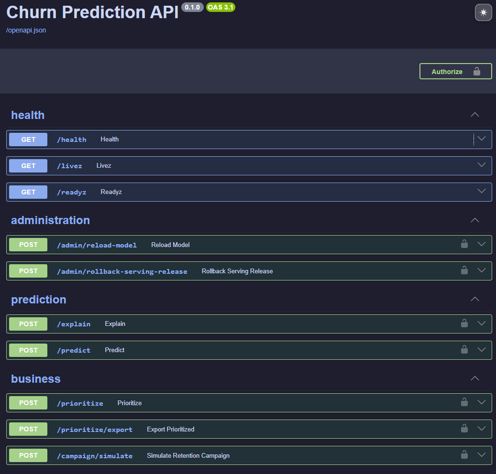

# Local Development

## Purpose

This guide describes how to start, bootstrap, test and reset the complete local
customer-churn MLOps stack.

## Prerequisites

- Python 3.12;
- `uv`;
- Docker with Docker Compose;
- GNU Make;
- `curl` and `jq`;
- `data/raw/Telco-Customer-Churn.csv`.

Raw and generated runtime data are intentionally excluded from version control.

## Configure the Project

```bash
git clone https://github.com/SL14-SL/mlops-churn-prediction.git
cd mlops-churn-prediction
cp .env.example .env
```

Set a development `API_KEY`. Local Make targets explicitly select local or
container-network service URLs and do not use the production Prefect Cloud URL.

Initialize the Python environment:

```bash
make setup
source .venv/bin/activate
```

## Start the Stack

```bash
make dev-up
make wait-prefect
```

Check container state:

```bash
docker compose ps
```

| Service | URL |
|---|---|
| Churn API | http://localhost:8000 |
| Swagger UI | http://localhost:8000/docs |
| Streamlit | http://localhost:8501 |
| MLflow | http://localhost:5000 |
| Prefect | http://localhost:4200 |
| Grafana | http://localhost:3000 |
| Prometheus | http://localhost:9090 |
| Alertmanager | http://localhost:9093 |

<p align="center">
  
</p>

The Swagger screenshot was captured from the production demo; the local API
exposes the same route groups.

## Initial Bootstrap

A fresh MLflow registry has no Champion. Create the first registered model and
serving release with:

```bash
make train-bootstrap
```

Bootstrap is intended only for an empty registry. Once a Champion exists, use
the normal or forced training targets.

Verify serving:

```bash
curl -fsS http://localhost:8000/livez | jq .
curl -fsS http://localhost:8000/readyz | jq .
curl -fsS http://localhost:8000/health | jq .
make test-serving-e2e
make predict-test
```

## Regular Training

Run the normal flow:

```bash
make train
```

Force candidate training regardless of the initial skip decision:

```bash
make train-force
```

`force` does not bypass the promotion gate. The candidate must still satisfy
the configured classification thresholds and Champion comparison.

## Prefect Deployment and Worker

Create the local pool and register the auto-retraining deployment:

```bash
make prefect-pool
make prefect-setup
```

Start the local worker in a separate terminal:

```bash
make prefect-worker
```

Run the auto-retraining decision flow once:

```bash
make auto-retrain
```

Local Prefect uses `http://localhost:4200/api`. Production training targets use
`PREFECT_API_URL` and `PREFECT_API_KEY` from `.env`, which point to Prefect
Cloud. This separation is intentional.

## Churn Lifecycle Demo

After bootstrapping the local Champion:

```bash
make demo-churn-lifecycle
```

The demo simulates prediction batches, delayed churn labels, performance
updates and retraining decisions.

## Controlled Retraining Experiments

The controlled experiments compare a static branch with a retraining-enabled
branch using identical ordered customer observations.

Run the real-label customer-cohort shift:

```bash
make churn-retraining-comparison
make churn-cohort-shift-comparison-plot
```
Run the audited synthetic concept-drift experiment:

```bash
make churn-concept-drift-comparison
make churn-concept-drift-comparison-plot
```
Generated manifests, archived monitoring tables, label-audit artifacts,
comparison summaries and figures are stored under:
`results/churn_retraining_comparison/`

These experiments run against the local Docker Compose stack. They are
portfolio demonstrations and do not modify the Google Cloud deployment.

## Serving Release Operations

Inspect the active release through readiness:

```bash
curl -fsS http://localhost:8000/readyz | jq .
```

Inspect local release files:

```bash
find models/serving_releases -maxdepth 2 -type f | sort
jq . models/active_serving_release.json
```

Reload the active release:

```bash
curl -fsS -X POST \
  -H "X-API-KEY: ${API_KEY}" \
  http://localhost:8000/admin/reload-model \
  | jq .
```

Activate a known previous release:

```bash
curl -fsS -X POST \
  -H "Content-Type: application/json" \
  -H "X-API-KEY: ${API_KEY}" \
  -d '{"release_id":"<previous-release-id>"}' \
  http://localhost:8000/admin/rollback-serving-release \
  | jq .
```

Always verify `/readyz` and `make predict-test` after a manual rollback.

## Monitoring Checks

Check the readiness metric:

```bash
curl -fsS http://localhost:8000/metrics \
  | grep -A2 api_serving_ready
```

Query Prometheus:

```bash
curl -sG \
  --data-urlencode 'query=api_serving_ready' \
  http://localhost:9090/api/v1/query \
  | jq .
```

Inspect loaded alert rules:

```bash
curl -s http://localhost:9090/api/v1/rules \
  | jq '.data.groups[].rules[] | {name, state, health}'
```

Validate Prometheus configuration using the container image:

```bash
docker run --rm \
  --entrypoint promtool \
  -v "$PWD/monitoring:/etc/prometheus:ro" \
  prom/prometheus:latest \
  check config /etc/prometheus/prometheus.yml
```

Validate Alertmanager:

```bash
docker compose run --rm \
  --no-deps \
  --entrypoint /bin/amtool \
  alertmanager \
  check-config /etc/alertmanager/alertmanager.yml
```

## Quality Checks

```bash
make lint
make test
docker compose config --quiet
```

## Troubleshooting

### API is alive but not ready

```bash
curl -i http://localhost:8000/readyz
docker compose logs --tail=200 api
```

Typical causes are an empty registry, a missing active release, inaccessible
MLflow artifacts, a checksum failure or an invalid bundle.

### Prefect client/server version warning

Keep the Prefect Docker image aligned with the version in `pyproject.toml` and
`uv.lock`. Recreate the Prefect service after changing the image.

### Host and container URLs

| Caller | MLflow URL | Prefect URL | API URL |
|---|---|---|---|
| Host | `http://localhost:5000` | `http://localhost:4200/api` | `http://localhost:8000` |
| Container | `http://mlflow:5000` | `http://prefect:4200/api` | `http://api:8080` |

### Empty Streamlit dashboard despite existing predictions

The dashboard resolves its data directory from `PROJECT_ROOT`. In the source
layout, `src/mlops_churn_prediction/constants.py` must resolve the repository
root rather than `/app/src`. Verify the expected path and mounted data:

```bash
docker compose exec -T dashboard uv run --no-sync python -c \
  "from mlops_churn_prediction.constants import PROJECT_ROOT; print(PROJECT_ROOT)"
docker compose exec -T dashboard ls -lh /app/data/predictions/inference_log.parquet
```

Reload the dashboard after correcting the path. Use one experiment's matching
predictions, delayed labels and performance history for a coherent dashboard.
Archived monitoring tables alone are not a replacement for inference logs.

### Clean reset

Use the guarded target when a completely fresh local registry and serving state
are required:

```bash
make reset-local-stack CONFIRM_RESET=1
```

Then restart and bootstrap:

```bash
make dev-up
make wait-prefect
make train-bootstrap
```

## Related Documentation

- [Architecture](architecture.md)
- [Serving releases](serving-releases.md)
- [Retraining policy](retraining-policy.md)
- [Monitoring and SLOs](monitoring-and-slos.md)
- [Operations runbook](operations-runbook.md)
