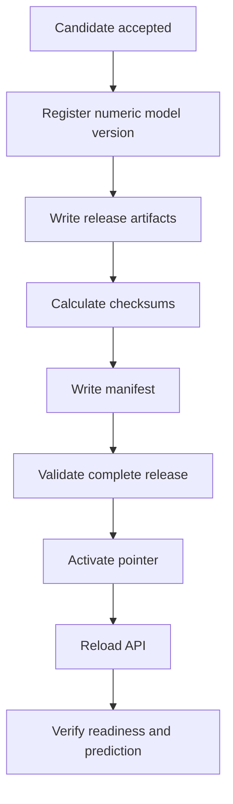

# Serving Releases

## Why a Serving Release Exists

A churn classifier depends on more than model weights. Correct decisions also
require the matching feature schema, decision threshold, preprocessing contract
and lineage metadata.

MLflow and the serving-release repository have separate responsibilities.
MLflow stores training lineage and registered model versions, backed by
persistent Cloud SQL metadata and GCS model artifacts. A serving release binds
one exact numeric model version to the matching feature schema, decision
threshold and semantic prediction probe.

Loading these values independently can create a mixed serving state. A serving
release binds the required components into one immutable, validated unit.

## Release Contents

| Object | Purpose |
|---|---|
| `serving_manifest.json` | Release identity, model metadata and artifact references |
| `feature_schema.json` | Exact feature columns, order and dtypes expected by the model |
| `prediction_probe.json` | Representative semantic verification request |

<p align="center">
  
</p>

<p align="center">
  <em>
    Versioned GCS serving release containing the feature schema,
    prediction probe and serving manifest.
  </em>
</p>

The manifest records:

- schema version and release ID;
- UTC creation time;
- exact model name, numeric version and MLflow run ID;
- immutable numeric model URI;
- model type;
- decision threshold;
- dataset version;
- configuration hash;
- Git commit when available from the runtime environment or repository;
- artifact paths and SHA-256 checksums.

The model itself remains an MLflow artifact. The release references the exact
numeric registry version rather than relying on a mutable alias during load.

### Model artifact lineage

Candidate evaluation and production registration produce explicit MLflow run
and model lineage. Only an accepted model is registered and assigned the
production `champion` alias.

MLflow stores experiment, run, model-version and alias metadata in Cloud SQL
for PostgreSQL. The corresponding model artifacts remain in GCS.

A serving manifest records the exact numeric model version and run ID selected
for the release. Runtime loading therefore does not depend on later changes to
the mutable `champion` alias.

<p align="center">
  
</p>

<p align="center">
  <em>
    Accepted production churn run linked to the registered model version
    referenced by the serving release.
  </em>
</p>

## Implementation Ownership

| Module | Responsibility |
|---|---|
| `src/inference/releases/manifest.py` | Manifest and artifact-reference models |
| `src/inference/releases/storage.py` | Release paths and storage operations |
| `src/inference/releases/repository.py` | Manifest, release and active-pointer loading |
| `src/inference/releases/publisher.py` | Complete publication and activation |
| `src/inference/model_manager.py` | Model and release loading into a bundle |
| `src/inference/serving_bundle.py` | Bundle contract and validation |
| `src/api/app.py` | Process-local activation and administrative endpoints |
| `flows/deployment_flow.py` | Reload, verification and rollback orchestration |

## Publication Flow



Publication validates the full release before updating the active pointer. A
failed publication leaves the previous pointer unchanged.

## Atomic API Reload

Reload follows a load-before-swap sequence:

1. resolve the active release ID;
2. load and validate the manifest;
3. validate artifact paths and checksums;
4. load the exact MLflow model version;
5. load the feature schema and decision threshold;
6. construct and validate the candidate `ServingBundle`;
7. replace the active in-memory bundle in one step.

An exception before the final step leaves the previous bundle active.

## Path and Checksum Protection

Artifact references must be relative and remain below the release root. Parent
traversal and absolute paths are rejected. Every referenced artifact is checked
against the SHA-256 value in the manifest.

These controls detect incomplete uploads, accidental modification and unsafe
paths before activation.

## Semantic Prediction Probe

The release includes a request representative of real churn inference. The
probe exercises:

- request validation;
- runtime data-quality checks;
- feature processing and schema alignment;
- model execution;
- probability and decision postprocessing.

Successful verification requires:

- HTTP 200;
- expected release ID;
- expected model version and run ID;
- expected number of predictions;
- finite churn probabilities between zero and one;
- structurally valid decision output.

Probe requests use a dedicated request context so they can be excluded from
normal prediction-history monitoring.

## Rollback

Deployment records the previously active release before activating a new one.
If reload or verification fails:

1. restore the previous active pointer;
2. reload the API;
3. verify that the previous bundle is ready;
4. report the new deployment as failed and rolled back.

Rollback changes a pointer. It does not rebuild the container or modify either
immutable release.

## Manual Operations

Inspect readiness and the current release:

```bash
curl -fsS http://localhost:8000/readyz | jq .
jq . models/active_serving_release.json
```

List local releases:

```bash
find models/serving_releases -mindepth 1 -maxdepth 1 -type d | sort
```

Reload the selected active release:

```bash
curl -fsS -X POST \
  -H "X-API-KEY: ${API_KEY}" \
  http://localhost:8000/admin/reload-model \
  | jq .
```

Roll back to a known release:

```bash
curl -fsS -X POST \
  -H "Content-Type: application/json" \
  -H "X-API-KEY: ${API_KEY}" \
  -d '{"release_id":"<previous-release-id>"}' \
  http://localhost:8000/admin/rollback-serving-release \
  | jq .
```

For production, replace the base URL and use the production API key. Verify
`/readyz`, `/health` and a prediction after activation.

## Immutability Rules

- Never edit a published release in place.
- Never reuse a release ID.
- Publish corrected artifacts as a new release.
- Keep the active pointer small and replace it atomically.
- Use a numeric model version in the final model URI.
- Retain enough historical releases for rollback.
- Never use the mutable Champion alias as the only release identity.

## Test Coverage

Tests cover:

- manifest and bundle validation;
- serialization and required lineage;
- publication and active-manifest loading;
- checksum failures;
- failed publication preserving the active release;
- path containment;
- missing-release rejection;
- failed API reload preserving the previous bundle;
- semantic prediction-probe behavior;
- deployment rollback behavior.

## Related Documentation

- [Architecture](architecture.md)
- [Production demo](production-demo.md)
- [Monitoring and SLOs](monitoring-and-slos.md)
- [Operations runbook](operations-runbook.md)

